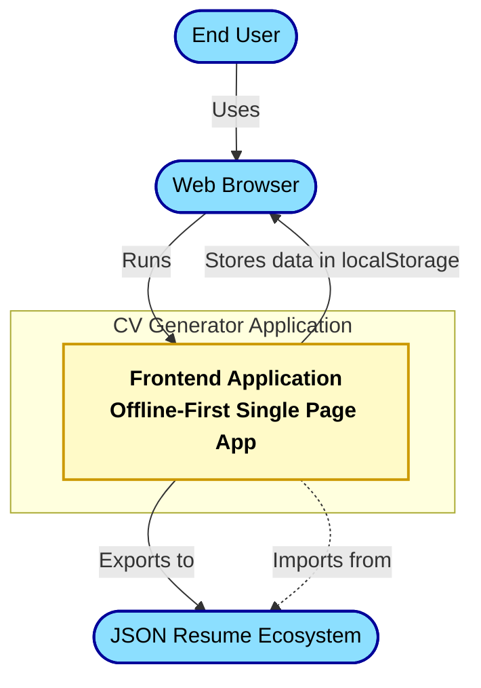
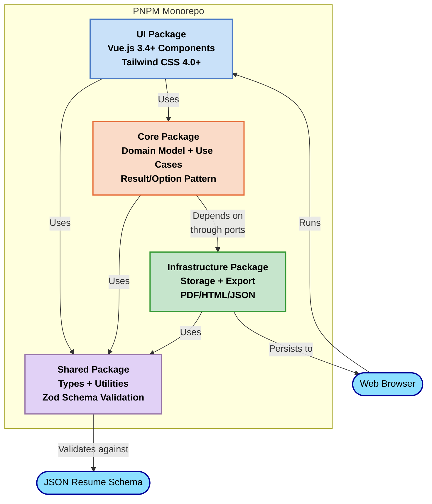
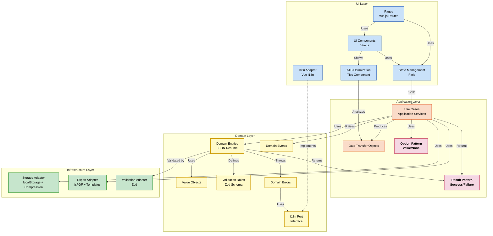
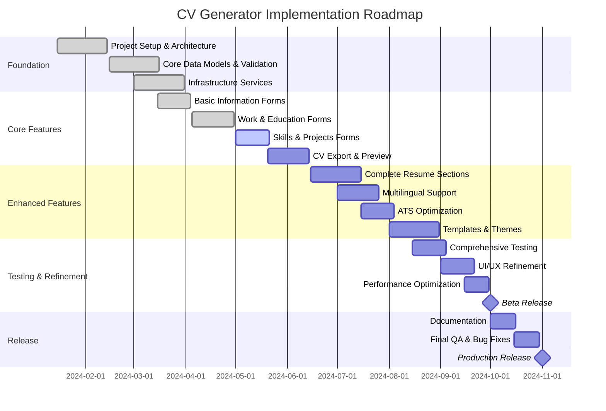

# Project Foundation Document: CV Generator

## Table of Contents

1. [Introduction](#1-introduction)
   1.1 [Purpose](#11-purpose)
   1.2 [Scope](#12-scope)
   1.3 [Glossary](#13-glossary)
2. [Vision](#2-vision)
   2.1 [Vision Statement](#21-vision-statement)
   2.2 [Strategic Alignment](#22-strategic-alignment)
   2.3 [Success Criteria](#23-success-criteria)
3. [Technical Vision](#3-technical-vision)
   3.1 [Principles](#31-principles)
   3.2 [Quality Attributes](#32-quality-attributes)
   3.3 [Constraints](#33-constraints)
4. [Overview](#4-overview)
   4.1 [Context](#41-context)
   4.2 [Objectives](#42-objectives)
   4.3 [Target Audience](#43-target-audience)
5. [Requirements](#5-requirements)
   5.1 [Functional Requirements](#51-functional-requirements)
   5.2 [Non-Functional Requirements](#52-non-functional-requirements)
   5.3 [Use Cases](#53-use-cases)
6. [Architecture](#6-architecture)
   6.1 [System Architecture](#61-system-architecture)
   6.2 [Data Architecture](#62-data-architecture)
   6.3 [UI Architecture](#63-ui-architecture)
7. [Technical Stack](#7-technical-stack)
   7.1 [Frontend](#71-frontend)
   7.2 [Infrastructure](#72-infrastructure)
   7.3 [Development Tools](#73-development-tools)
8. [Planning](#8-planning)
   8.1 [Timeline](#81-timeline)
   8.2 [Resources](#82-resources)
   8.3 [Risks](#83-risks)
9. [KPIs](#9-kpis)
   9.1 [Performance Metrics](#91-performance-metrics)
   9.2 [Success Metrics](#92-success-metrics)
10. [Testing](#10-testing)
    10.1 [Testing Strategy](#101-testing-strategy)
    10.2 [Test Environments](#102-test-environments)
11. [Operations](#11-operations)
    11.1 [Deployment](#111-deployment)
    11.2 [Maintenance](#112-maintenance)
12. [Development](#12-development)
    12.1 [Standards](#121-standards)
    12.2 [Collaboration](#122-collaboration)
    12.3 [Documentation](#123-documentation)
13. [Appendices](#13-appendices)
    13.1 [References](#131-references)
    13.2 [Architectural Decision Records](#132-architectural-decision-records)

## 1. Introduction

### 1.1 Purpose

This Project Foundation Document (PFD) establishes the foundation for the CV Generator project, a modern web application designed to help users create, manage, and export professional CVs using the JSON Resume standard. This document serves as the authoritative reference for requirements, architecture, and implementation guidance, aligning all stakeholders on the project scope, technical approach, and business objectives.

### 1.2 Scope

The CV Generator project encompasses:

- A Vue.js-based Single Page Application for creating and editing CVs
- Full support for the JSON Resume schema standard
- Multilingual user interface (English and French)
- Offline-first architecture with local storage persistence
- Export functionality in multiple formats (JSON, HTML, PDF)
- Real-time validation and ATS optimization guidance
- Clean Architecture implementation with a PNPM monorepo structure

Out of scope for this project:

- Backend server-side implementation
- User authentication and account management
- Cloud storage of CV data
- AI-based CV generation or optimization
- Mobile native applications (though responsive web design is in scope)

### 1.3 Glossary

| Term                      | Definition                                                                                                  |
| ------------------------- | ----------------------------------------------------------------------------------------------------------- |
| **ATS**                   | Applicant Tracking System - Software used by employers to manage job applications                           |
| **Clean Architecture**    | Software design pattern that separates concerns into layers with clear dependencies                         |
| **CV**                    | Curriculum Vitae - A document summarizing a person's education, work experience, skills, and qualifications |
| **DDD**                   | Domain-Driven Design - An approach to software development focusing on the core domain and domain logic     |
| **I18n**                  | Internationalization - Process of designing software for adaptation to different languages                  |
| **JSON Resume**           | Open standard format for resumes (https://jsonresume.org/schema/)                                           |
| **PNPM**                  | Fast, disk-efficient package manager used in this project's monorepo                                        |
| **PWA**                   | Progressive Web Application - Web app that can function offline with app-like features                      |
| **Result/Option Pattern** | Functional programming pattern for handling errors and optional values                                      |
| **SPA**                   | Single Page Application - Web app that loads a single HTML page and updates content dynamically             |
| **TypeScript**            | Strongly typed programming language that builds on JavaScript                                               |
| **Value Object**          | Immutable object that is defined by its attributes rather than its identity                                 |
| **Vue.js**                | Progressive JavaScript framework for building user interfaces                                               |
| **Zod**                   | TypeScript-first schema validation library                                                                  |

## 2. Vision

### 2.1 Vision Statement

To create a modern, user-friendly CV builder that empowers professionals to create, maintain, and export standardized CVs in multiple formats while ensuring data portability, offline access, and compliance with the JSON Resume standard.

### 2.2 Strategic Alignment

The CV Generator project aligns with the following strategic objectives:

1. **Open Standards Adoption**: Supporting and promoting the JSON Resume standard for CV data portability
2. **User Data Ownership**: Giving users complete control over their CV data with offline-first architecture
3. **Developer Experience**: Implementing modern architecture patterns for maintainability and extendability
4. **Internationalization**: Breaking language barriers by providing multilingual interfaces
5. **Accessibility**: Ensuring the application is usable by people with diverse needs and abilities

### 2.3 Success Criteria

| Criterion            | Metric                                   | Target       | Measurement Method              |
| -------------------- | ---------------------------------------- | ------------ | ------------------------------- |
| Feature Completeness | JSON Resume schema sections implemented  | 100%         | Feature audit                   |
| Multilingual Support | UI languages available                   | ≥ 2 (EN, FR) | Language verification           |
| Code Quality         | Test coverage for critical functionality | ≥ 80%        | Test coverage reports           |
| Performance          | Application load time                    | < 2 seconds  | Lighthouse metrics              |
| Usability            | CV completion success rate               | > 90%        | User testing                    |
| Validation           | Error rate in validation                 | < 1%         | Error tracking                  |
| Export Reliability   | Successful export rate                   | > 99%        | Export success logs             |
| Accessibility        | WCAG compliance level                    | AA           | Automated accessibility testing |

## 3. Technical Vision

### 3.1 Principles

The CV Generator project follows these key architectural principles:

1. **Clean Architecture**: Separation of concerns with clear dependencies between layers

   - Domain logic independent of UI, frameworks, and external concerns
   - Inward dependencies only (UI → Application → Domain)
   - Use of ports and adapters pattern for external dependencies

2. **Domain-Driven Design**: Focus on the core domain and domain logic

   - Rich domain models with encapsulated business rules
   - Ubiquitous language shared across the project
   - Value Objects for domain concepts like Email, PhoneNumber, etc.

3. **User-Centric Design**: Prioritizing user experience over technical convenience

   - Intuitive interfaces with clear guidance
   - Immediate feedback on user actions
   - Progressive disclosure of complex functionality

4. **Offline-First**: Application fully functional without an internet connection

   - Local storage of CV data
   - Graceful handling of connectivity changes
   - Persistence of user session and data

5. **Standard Compliance**: Adherence to the JSON Resume schema
   - Validation against the official schema
   - Export compatibility with the ecosystem
   - Extensibility for schema updates

### 3.2 Quality Attributes

| Attribute                | Requirement                                                           | Measurement                                             |
| ------------------------ | --------------------------------------------------------------------- | ------------------------------------------------------- |
| **Performance**          | Application load time < 2s, form interactions < 0.5s                  | Lighthouse metrics, user interaction timing             |
| **Reliability**          | No data loss during normal operation, graceful handling of errors     | Error tracking, automated testing                       |
| **Security**             | User data stored only locally, no sensitive data transmission         | Security audit, OWASP compliance                        |
| **Maintainability**      | Modular architecture, comprehensive tests, documentation              | Code reviews, test coverage, documentation completeness |
| **Usability**            | Intuitive interface, helpful guidance, responsive design              | User testing, accessibility scores, device testing      |
| **Scalability**          | Support for large CV datasets, multiple CV documents                  | Performance testing with large datasets                 |
| **Accessibility**        | WCAG 2.1 AA compliance for all user interfaces                        | Automated accessibility testing, manual verification    |
| **Internationalization** | Support for English and French, with extensibility for more languages | Language switch testing, i18n coverage                  |
| **Compatibility**        | Support for modern browsers (last 2 versions)                         | Cross-browser testing                                   |

### 3.3 Constraints

#### Technical Constraints

- **Client-Side Only**: No server-side components (purely frontend application)
- **Modern Browser Support**: Target modern browsers with localStorage and ES2020+ support
- **Mobile Responsiveness**: Must function on various screen sizes (mobile, tablet, desktop)
- **Offline Operation**: Must function without internet connectivity
- **Local Storage**: Limited by browser localStorage capacity (typically 5-10MB)

#### Business Constraints

- **Open Source**: Codebase must be open source-ready with appropriate licensing
- **JSON Resume Compliance**: Must adhere to the JSON Resume schema standard
- **No Monetization Requirements**: Project is not required to generate revenue
- **Small Team**: Development resources limited to a small team (1-3 developers)

#### Regulatory/Legal Constraints

- **GDPR Compliance**: User data stored locally only, no tracking
- **Accessibility Requirements**: WCAG 2.1 AA compliance for public-facing interfaces
- **License Compatibility**: All dependencies must have compatible open-source licenses

## 4. Overview

### 4.1 Context

CV Generator addresses the challenge of creating and maintaining professional CVs in a standardized format. Unlike traditional word processors or proprietary CV builders, it embraces the open JSON Resume standard to ensure data portability while providing a user-friendly interface.



The application sits at the intersection of:

- **User Experience**: Professionals need intuitive tools to create impressive CVs
- **Technical Standards**: The JSON Resume format ensures interoperability and data portability
- **Modern Web Technologies**: Vue.js, TypeScript, and local browser storage enable a responsive, offline-first experience

### 4.2 Objectives

#### Primary Objectives

1. Create a user-friendly interface for editing CVs in JSON Resume format
2. Provide real-time validation against the JSON Resume schema
3. Enable export in multiple formats (JSON, HTML, PDF)
4. Support internationalization with multiple UI languages (English and French)
5. Implement a clean, maintainable architecture for long-term sustainability
6. Ensure complete offline operation with localStorage persistence

#### Technical Objectives

1. Implement Clean Architecture patterns to separate concerns
2. Create a monorepo package structure with clear boundaries
3. Utilize TypeScript for type safety and improved developer experience
4. Implement comprehensive testing strategy covering all layers
5. Design for extensibility to add additional features and languages

### 4.3 Target Audience

#### User Personas

1. **Alex, Front-end Developer (28 years old)**

   - Wants to maintain CV in structured, versioned format
   - Prefers working with open formats like JSON
   - Needs to export as PDF for job applications
   - Primary value: technical control and data portability

2. **Sophie, Job Seeker (35 years old)**

   - Regularly applies to jobs through online platforms
   - Needs advice to get her CV through ATS filters
   - Wants a simple but comprehensive interface
   - Primary value: ATS optimization and ease of use

3. **Marc, Multi-profile Freelancer (42 years old)**

   - Maintains multiple CV versions for different types of assignments
   - Needs to easily modify and adapt his CV
   - Prefers working offline on his documents
   - Primary value: flexibility and customization

4. **Lucie, International Consultant (31 years old)**
   - Works on international projects requiring CVs in different languages
   - Appreciates interfaces available in her native language
   - Needs to adapt her CV according to cultural standards
   - Primary value: international adaptation and linguistic flexibility

#### Stakeholder Groups

| Stakeholder                  | Interest                                        | Influence                                  |
| ---------------------------- | ----------------------------------------------- | ------------------------------------------ |
| **End Users**                | Usability, feature completeness, export quality | Provide feedback, drive feature priorities |
| **Developers**               | Code quality, architecture, documentation       | Build and maintain the application         |
| **JSON Resume Community**    | Standard compliance, interoperability           | Validate schema compliance                 |
| **Open Source Contributors** | Codebase accessibility, contribution guidelines | Enhance and extend the application         |

## 5. Requirements

### 5.1 Functional Requirements

| ID    | Requirement                                                                       | Priority |
| ----- | --------------------------------------------------------------------------------- | -------- |
| FR-01 | CV Editor interface for creating and editing CV data following JSON Resume schema | High     |
| FR-02 | Form validation against JSON Resume schema with helpful error messages            | High     |
| FR-03 | Data persistence using browser localStorage                                       | High     |
| FR-04 | CV export in JSON Resume format                                                   | High     |
| FR-05 | CV export in PDF format with basic styling                                        | High     |
| FR-06 | CV export in HTML format                                                          | Medium   |
| FR-07 | Multilingual interface with English and French support                            | High     |
| FR-08 | Form for personal information (basics section)                                    | High     |
| FR-09 | Form for work experience with chronological sorting                               | High     |
| FR-10 | Form for education history with chronological sorting                             | High     |
| FR-11 | Form for skills with level indicators                                             | High     |
| FR-12 | Form for projects with links and descriptions                                     | Medium   |
| FR-13 | Form for volunteer work                                                           | Medium   |
| FR-14 | Form for awards and recognitions                                                  | Medium   |
| FR-15 | Form for publications                                                             | Medium   |
| FR-16 | Form for certifications                                                           | Medium   |
| FR-17 | Form for languages                                                                | Medium   |
| FR-18 | Form for interests                                                                | Low      |
| FR-19 | Form for references                                                               | Low      |
| FR-20 | Real-time CV preview                                                              | Medium   |
| FR-21 | ATS optimization suggestions                                                      | Medium   |
| FR-22 | Drag-and-drop reordering for list items                                           | Medium   |
| FR-23 | Import from existing JSON Resume file                                             | Medium   |
| FR-24 | CV template selection for exports                                                 | Low      |
| FR-25 | Auto-save functionality                                                           | High     |

### 5.2 Non-Functional Requirements

| ID     | Requirement                                                          | Priority |
| ------ | -------------------------------------------------------------------- | -------- |
| NFR-01 | Performance: Application load time < 2 seconds                       | High     |
| NFR-02 | Performance: Form interaction response time < 0.5 seconds            | High     |
| NFR-03 | Usability: Intuitive interface with helpful guidance for users       | High     |
| NFR-04 | Usability: Responsive design for mobile, tablet, and desktop devices | High     |
| NFR-05 | Accessibility: WCAG 2.1 AA compliance                                | High     |
| NFR-06 | Reliability: No data loss during normal operation                    | High     |
| NFR-07 | Reliability: Graceful error handling with user recovery options      | High     |
| NFR-08 | Maintainability: Clean Architecture with separation of concerns      | High     |
| NFR-09 | Maintainability: Comprehensive test coverage > 80% for critical code | High     |
| NFR-10 | Compatibility: Support for modern browsers (last 2 versions)         | High     |
| NFR-11 | Security: User data stored only locally with no data transmission    | High     |
| NFR-12 | Internationalization: Full support for English and French interfaces | High     |
| NFR-13 | Internationalization: Extensible for additional languages            | Medium   |
| NFR-14 | Scalability: Support for large CV datasets                           | Medium   |
| NFR-15 | Scalability: Support for multiple CV documents                       | Low      |

### 5.3 Use Cases

#### Primary Use Case: Creating a New CV

**Actors**: End User
**Preconditions**: User has accessed the application
**Basic Flow**:

1. User opens the application
2. User starts a new CV
3. User completes personal information section
4. User adds work experience entries
5. User adds education entries
6. User adds skills and other relevant sections
7. User previews the CV
8. User exports the CV in desired format
9. System saves CV data to localStorage

**Alternative Flows**:

- User can save and return to the CV creation process later
- User can import an existing JSON Resume file to start
- User can change UI language during the process

**Postconditions**: New CV created and saved to localStorage, optionally exported

#### Secondary Use Case: Editing an Existing CV

**Actors**: End User
**Preconditions**: User has a CV saved in localStorage
**Basic Flow**:

1. User opens the application
2. System loads existing CV data from localStorage
3. User navigates to the section requiring changes
4. User makes updates to the relevant fields
5. System validates the changes in real-time
6. User previews the updated CV
7. User exports the updated CV
8. System saves the updated CV data to localStorage

**Alternative Flows**:

- User can choose to create a new CV version instead of updating
- User can discard changes and revert to saved version

**Postconditions**: CV updated and saved to localStorage, optionally exported

## 6. Architecture

### 6.1 System Architecture

The CV Generator application follows Clean Architecture principles, organized in a PNPM monorepo with clearly separated packages.



#### Package Structure

1. **UI Package** (@cv-generator/ui)

   - **Technology**: Vue.js 3.4+, Tailwind CSS 4.0+, Vue Router 4.2+, Pinia 2.3+
   - **Responsibility**: User interface components, pages, and stores (presentation)
   - **Key Features**: Responsive design, internationalization, form components, ATS optimization tips
   - **Dependencies**: Core package, Shared package

2. **Core Package** (@cv-generator/core)

   - **Technology**: TypeScript 5.7+, Result/Option pattern
   - **Responsibility**: Domain entities, use cases based on JSON Resume standard
   - **Key Features**: Business logic, validation rules, domain events, error handling
   - **Dependencies**: Shared package, Infrastructure interfaces (ports)

3. **Infrastructure Package** (@cv-generator/infrastructure)

   - **Technology**: TypeScript 5.7+, localStorage API, jsPDF 2.5+
   - **Responsibility**: Concrete implementations for storage and exports
   - **Key Features**: Data persistence, PDF/HTML/JSON generation, data compression, template rendering
   - **Dependencies**: Shared package

4. **Shared Package** (@cv-generator/shared)
   - **Technology**: TypeScript 5.7+, Zod 3.22+
   - **Responsibility**: Shared types, constants, utilities, validators, and i18n keys
   - **Key Features**: JSON Resume schema validation, shared interfaces, utility functions, centralized translation keys
   - **Dependencies**: None (foundational package)

#### Clean Architecture Components



### 6.2 Data Architecture

The core data structure follows the JSON Resume schema, with extensions for application-specific needs.

#### Core Data Models

| Entity    | Description                       | Key Properties                                   |
| --------- | --------------------------------- | ------------------------------------------------ |
| Resume    | Core domain entity for CV data    | basics, work, education, skills, etc.            |
| Basics    | Personal information              | name, email, location, profiles                  |
| Work      | Work experience                   | name, position, startDate, endDate, highlights   |
| Education | Educational background            | institution, area, studyType, startDate, endDate |
| Skills    | Professional skills               | name, level, keywords                            |
| Projects  | Personal or professional projects | name, description, keywords, startDate, endDate  |

#### Domain-Specific Value Objects

| Value Object | Purpose                            | Validation                   |
| ------------ | ---------------------------------- | ---------------------------- |
| Email        | Email address validation           | Format, domain validation    |
| PhoneNumber  | Phone number formatting/validation | Format, country code         |
| DateRange    | Date range with optional "current" | Start before end, ISO format |
| MarkdownText | Text with markdown support         | Valid markdown format        |
| URL          | Web URL validation                 | Format, protocol             |

#### Data Flow

1. **Input**: User enters CV data through form components
2. **Validation**: Data validated against JSON Resume schema using Zod
3. **Processing**: Validated data transformed into domain entities
4. **Storage**: Domain entities serialized and stored in localStorage
5. **Export**: Domain entities transformed into export formats (JSON, HTML, PDF)

### 6.3 UI Architecture

The UI follows a component-based architecture using Vue.js with Composition API.

#### Key UI Patterns

1. **Composables**: Reusable logic extracted into composables for form handling, validation, and data management
2. **Component Hierarchy**: Nested components with clear responsibilities and props/events communication
3. **State Management**: Pinia stores for global state with modular organization by domain
4. **Reactive Forms**: Form components with two-way binding and real-time validation
5. **Event Bus**: Minimal event bus for cross-component communication
6. **I18n Integration**: Internationalization integrated at all levels with dynamic language switching

#### UI Components

| Component Type        | Purpose                         | Examples                                           |
| --------------------- | ------------------------------- | -------------------------------------------------- |
| Form Components       | Data entry for CV sections      | BasicsForm, WorkForm, EducationForm                |
| List Components       | Display and manage collections  | WorkList, SkillList, ProjectList                   |
| Navigation Components | Application navigation          | MainNav, SectionNav, ProgressTracker               |
| Layout Components     | Page structure and organization | AppLayout, SectionLayout, FormLayout               |
| Utility Components    | Reusable UI elements            | DatePicker, MarkdownEditor, TagInput               |
| Feedback Components   | User feedback and validation    | ValidationError, SuccessMessage, ProgressIndicator |

## 7. Technical Stack

### 7.1 Frontend

| Technology   | Version | Purpose                                       | Justification                                       |
| ------------ | ------- | --------------------------------------------- | --------------------------------------------------- |
| Vue.js       | 3.4+    | Frontend framework and component architecture | Reactivity, composition API, TypeScript support     |
| TypeScript   | 5.7+    | Type safety and enhanced developer experience | Strong typing, better IDE support, error prevention |
| Tailwind CSS | 4.0+    | Utility-first styling framework               | Responsive design, minimal CSS, customizability     |
| Vite         | 6.0+    | Build tool and development server             | Fast HMR, efficient bundling, plugins               |
| Vue Router   | 4.2+    | Client-side routing and navigation            | Seamless SPA transitions, lazy loading              |
| Pinia        | 2.3+    | State management with TypeScript support      | DevTools, modular stores, composition API           |
| Vue I18n     | 9.2+    | Internationalization solution for Vue         | Multilingual support, message format, pluralization |

#### UI Component Libraries

| Library             | Purpose                | Justification                          |
| ------------------- | ---------------------- | -------------------------------------- |
| @heroicons/vue      | SVG icons              | High-quality icons, Vue integration    |
| Tailwind Forms      | Form styling utilities | Consistent form styling, accessibility |
| Tailwind Typography | Text content styling   | Rich text formatting for CV previews   |

### 7.2 Infrastructure

| Technology      | Version | Purpose                             | Justification                                 |
| --------------- | ------- | ----------------------------------- | --------------------------------------------- |
| localStorage    | Web API | Client-side data persistence        | Offline support, no backend requirement       |
| jsPDF           | 2.5+    | PDF generation                      | Client-side PDF creation without backend      |
| IndexedDB       | Web API | Potential future enhanced storage   | Larger storage capacity than localStorage     |
| Zod             | 3.22+   | Schema validation and type checking | Runtime validation, TypeScript integration    |
| html-to-pdfmake | Latest  | HTML to PDF conversion              | Structured PDF generation from HTML templates |

### 7.3 Development Tools

| Tool           | Version | Purpose                                | Justification                                 |
| -------------- | ------- | -------------------------------------- | --------------------------------------------- |
| pnpm           | 10.0+   | Package manager with monorepo support  | Efficient disk usage, workspaces, performance |
| Vitest         | 3.0+    | Testing framework integrated with Vite | Fast test execution, Vue component testing    |
| Biome          | 1.9+    | Code linting and formatting            | Fast, modern linter and formatter             |
| Husky          | 9.0+    | Git hooks automation                   | Pre-commit validation, consistent quality     |
| Docker         | Latest  | Containerization                       | Consistent development environments           |
| GitHub Actions | N/A     | CI/CD pipelines                        | Automated testing, building, and deployment   |

## 8. Planning

### 8.1 Timeline



### 8.2 Resources

#### Team Composition

| Role               | Responsibilities                                    | Allocation |
| ------------------ | --------------------------------------------------- | ---------- |
| Technical Lead     | Architecture, coding standards, technical decisions | Full-time  |
| Frontend Developer | Vue components, UI implementation, testing          | Full-time  |
| UI/UX Designer     | Design system, user experience, accessibility       | Part-time  |
| QA Engineer        | Testing, quality assurance, test automation         | Part-time  |

#### Development Environment

| Resource             | Specification                                  | Purpose                        |
| -------------------- | ---------------------------------------------- | ------------------------------ |
| Development Machines | Modern hardware with 16GB+ RAM                 | Local development              |
| Docker Containers    | Standard development environment configuration | Consistent environments        |
| GitHub Repository    | Source code management, CI/CD pipelines        | Version control, collaboration |
| Cloud Hosting        | Static site hosting for production deployment  | Application hosting            |

### 8.3 Risks

| Risk ID | Description                                         | Probability | Impact | Mitigation Strategy                                            |
| ------- | --------------------------------------------------- | ----------- | ------ | -------------------------------------------------------------- |
| R-01    | Browser localStorage limitations (size constraints) | Medium      | High   | Implement data compression, chunking, and size monitoring      |
| R-02    | JSON Resume schema changes or updates               | Low         | Medium | Design for schema versioning and backward compatibility        |
| R-03    | Cross-browser compatibility issues                  | Medium      | Medium | Implement comprehensive browser testing and feature detection  |
| R-04    | Performance issues with large CVs                   | Medium      | Medium | Optimize rendering with virtualization and lazy loading        |
| R-05    | PDF export quality inconsistencies                  | High        | Medium | Develop robust templates with thorough testing across browsers |
| R-06    | Limited development resources                       | Medium      | High   | Prioritize features by user value, use component libraries     |
| R-07    | Accessibility compliance challenges                 | Medium      | High   | Integrate accessibility testing early, follow WCAG guidelines  |
| R-08    | Translation quality and completeness                | Medium      | Medium | Implement comprehensive i18n testing framework                 |
| R-09    | User data loss due to localStorage clearing         | Medium      | High   | Implement backup/restore features and warning messages         |
| R-10    | ATS recommendations becoming outdated               | Low         | Medium | Design modular ATS system with updatable rules                 |

## 9. KPIs

### 9.1 Performance Metrics

| Metric                 | Description                    | Target            | Measurement Method          |
| ---------------------- | ------------------------------ | ----------------- | --------------------------- |
| Page Load Time         | Time to initial render         | < 2.0s            | Lighthouse, Web Vitals      |
| Time to Interactive    | Time until fully interactive   | < 3.5s            | Lighthouse, Web Vitals      |
| First Input Delay      | Time before input is processed | < 100ms           | Web Vitals                  |
| Form Response Time     | Time for form field updates    | < 100ms           | Custom performance tracking |
| Export Generation Time | Time to generate export files  | < 3.0s            | Custom performance tracking |
| Memory Usage           | Browser memory consumption     | < 100MB           | Performance monitoring      |
| Bundle Size            | JavaScript bundle size         | < 300KB (gzipped) | Build metrics               |

### 9.2 Success Metrics

| Metric               | Description                                  | Target       | Measurement Method |
| -------------------- | -------------------------------------------- | ------------ | ------------------ |
| Feature Usage        | Percentage of available features used        | > 70%        | Feature analytics  |
| Form Completion Rate | Percentage of forms fully completed          | > 90%        | Form tracking      |
| CV Export Rate       | Percentage of users exporting CVs            | > 80%        | Export tracking    |
| Error Rate           | Percentage of operations resulting in errors | < 1%         | Error logging      |
| User Satisfaction    | Rating from user feedback                    | > 4.5/5.0    | Feedback forms     |
| Return Usage         | Percentage of users returning                | > 50%        | Usage analytics    |
| Time to Complete CV  | Average time to complete a CV                | < 30 minutes | Session tracking   |
| Feature Discovery    | Percentage of features discovered            | > 80%        | Usage analytics    |

## 10. Testing

### 10.1 Testing Strategy

The CV Generator project employs a comprehensive testing approach covering all aspects of the application:

#### Unit Testing

- **Scope**: Individual functions, components, and services
- **Tools**: Vitest, Vue Test Utils
- **Coverage Target**: 80%+ for critical code paths
- **Focus Areas**:
  - Domain entities and value objects
  - Validation logic
  - Application services and use cases
  - UI component props, events, and rendering
  - State management logic

#### Integration Testing

- **Scope**: Interactions between components and services
- **Tools**: Vitest, Vue Test Utils
- **Coverage Target**: 70%+ of integration points
- **Focus Areas**:
  - Form submissions and validation
  - Data flow between components and stores
  - Storage and retrieval operations
  - Export functionality

#### End-to-End Testing

- **Scope**: Complete user flows
- **Tools**: Playwright
- **Coverage Target**: 100% of critical user journeys
- **Focus Areas**:
  - CV creation workflow
  - Form navigation and submission
  - Export functionality
  - Language switching

#### Special Testing Areas

| Area                      | Approach                                  | Tools                       |
| ------------------------- | ----------------------------------------- | --------------------------- |
| **Accessibility Testing** | Automated scans + manual testing          | axe, WAVE, screen readers   |
| **Internationalization**  | Validate all UI elements in each language | Custom i18n test suite      |
| **Responsive Design**     | Test across device sizes                  | Playwright device emulation |
| **Browser Compatibility** | Test in modern browsers                   | BrowserStack, Playwright    |
| **Performance Testing**   | Measure load times and interactions       | Lighthouse, custom metrics  |

### 10.2 Test Environments

| Environment           | Purpose                        | Infrastructure                           |
| --------------------- | ------------------------------ | ---------------------------------------- |
| Local Development     | Day-to-day development testing | Developer machines, Vitest               |
| CI Pipeline           | Automated testing on commit/PR | GitHub Actions, Vitest, Playwright       |
| Pre-Production        | Final testing before release   | Staging environment, manual verification |
| Production Monitoring | Monitor live application       | Error tracking, performance monitoring   |

#### Test Data Strategy

- **Test Fixtures**: Predefined CV data for consistent testing
- **Mock Services**: Simulation of external dependencies
- **Test Factories**: Generate test data with customizable properties
- **Golden Files**: Reference exports for comparison testing

## 11. Operations

### 11.1 Deployment

#### Deployment Strategy

The CV Generator is designed as a static web application that can be deployed to any static hosting service.

| Environment | Purpose             | Infrastructure                        |
| ----------- | ------------------- | ------------------------------------- |
| Development | Local development   | Developer machines, Vite dev server   |
| Staging     | Pre-release testing | Static hosting with staging subdomain |
| Production  | Public access       | Static hosting with CDN               |

#### Deployment Process

1. **Build Phase**:

   - Run tests to ensure quality
   - Build static assets with production optimization
   - Generate locale bundles for multilingual support
   - Perform bundle analysis and optimization

2. **Deployment Phase**:

   - Upload static assets to hosting platform
   - Update CDN configuration if needed
   - Verify deployment with smoke tests
   - Implement cache control headers

3. **Post-Deployment**:
   - Monitor for errors and issues
   - Collect initial performance metrics
   - Verify all features functioning correctly
   - Enable new features gradually if needed

#### Infrastructure Requirements

- **Hosting**: Any static file hosting service (GitHub Pages, Netlify, Vercel, etc.)
- **CDN**: Content Delivery Network for global distribution
- **SSL**: HTTPS required for secure operation
- **Monitoring**: Basic uptime and error monitoring

### 11.2 Maintenance

#### Regular Maintenance Activities

| Activity              | Frequency   | Description                                                      |
| --------------------- | ----------- | ---------------------------------------------------------------- |
| Dependency Updates    | Monthly     | Update libraries and dependencies to latest compatible versions  |
| Browser Compatibility | Quarterly   | Verify functionality in latest browser versions                  |
| Security Audit        | Quarterly   | Review dependencies for vulnerabilities, perform security checks |
| Performance Review    | Quarterly   | Review performance metrics, identify optimization opportunities  |
| Feature Review        | Bi-annually | Review feature usage, identify improvement opportunities         |

#### Support Model

- **Error Reporting**: In-app error reporting mechanism
- **Feedback Collection**: User feedback form for suggestions and issues
- **Documentation**: Comprehensive user guide and developer documentation
- **GitHub Issues**: Public issue tracking for community contributions

#### Disaster Recovery

Although the application is client-side only with localStorage persistence, the following disaster recovery strategies apply:

- **Data Recovery**: Implement export/import functionality for user data backup
- **Application Rollback**: Maintain previous deployment versions for quick rollback
- **Version Control**: All code changes tracked in Git with the ability to revert
- **Local Storage Management**: Implement data migration strategy for schema changes

## 12. Development

### 12.1 Standards

#### Coding Standards

- **Naming Conventions**:

  - **Variables/Functions**: camelCase, descriptive (e.g., `userData`, `fetchUserData()`)
  - **Components**: PascalCase (e.g., `BaseForm.vue`, `ResumePreview.vue`)
  - **Files**: kebab-case for utilities, PascalCase for components
  - **Constants**: UPPER_SNAKE_CASE (e.g., `MAX_FILE_SIZE`)
  - **Interfaces/Types**: PascalCase with appropriate suffix (e.g., `UserInterface`, `ResumeType`)

- **Formatting**:

  - Indentation: 2 spaces
  - Line length: 100 characters maximum
  - Trailing commas: Required for multiline arrays/objects
  - Semicolons: Required
  - Quotes: Single quotes for JavaScript, double quotes for JSX attributes

- **Comments and Documentation**:
  - JSDoc comments for public interfaces and functions
  - Inline comments for complex logic or non-obvious code
  - Component documentation with examples
  - i18n key documentation

#### Architecture Standards

- **Clean Architecture** principles enforced across the codebase
- Separation of concerns between packages
- Dependency flow inward (UI depends on Core, not vice versa)
- Use of interfaces for boundary crossing
- Explicit error handling with Result pattern
- Strong typing with TypeScript

#### UI/UX Standards

- WCAG 2.1 AA accessibility compliance
- Responsive design for all screen sizes
- Consistent UI patterns throughout the application
- Real-time feedback for user actions
- Intuitive navigation with clear hierarchy

### 12.2 Collaboration

#### Version Control

- **Repository**: GitHub
- **Branching Strategy**:

  - `main`: Production-ready code
  - `develop`: Integration branch for features
  - `feature/*`: Feature branches
  - `bugfix/*`: Bug fix branches
  - `release/*`: Release preparation branches

- **Commit Messages**: Conventional Commits format

  ```
  type(scope): description

  [optional body]

  [optional footer]
  ```

  Types: feat, fix, docs, style, refactor, test, chore

#### Pull Request Process

1. Create a feature/bugfix branch from develop
2. Implement changes with tests
3. Submit PR with clear description of changes
4. PR reviewed by at least one team member
5. Automatic checks (linting, tests) must pass
6. Address review comments and update PR
7. Merge to develop upon approval

#### Continuous Integration

- Automated testing on PR creation/update
- Code quality checks (linting, formatting)
- Build verification
- Bundle size analysis

### 12.3 Documentation

#### Code Documentation

- **API Documentation**: JSDoc comments for interfaces and functions
- **Component Documentation**: Props, events, usage examples
- **Architecture Documentation**: Package structure, dependencies, patterns
- **Type Documentation**: TypeScript interfaces, types, and enums

#### User Documentation

- **User Guide**: How to use the application
- **FAQ**: Common questions and answers
- **Tutorial**: Step-by-step guide for new users
- **Export Guide**: How to use exported files

#### Developer Documentation

- **Setup Guide**: How to set up the development environment
- **Contributing Guidelines**: How to contribute to the project
- **Testing Guide**: How to write and run tests
- **Architecture Overview**: Understanding the codebase structure

## 13. Appendices

### 13.1 References

- [JSON Resume Schema](https://jsonresume.org/schema/) - The standard schema for resume data
- [Vue.js Documentation](https://vuejs.org/guide/introduction.html) - Official Vue.js documentation
- [Clean Architecture](https://blog.cleancoder.com/uncle-bob/2012/08/13/the-clean-architecture.html) - Robert C. Martin's Clean Architecture principles
- [Web Content Accessibility Guidelines (WCAG) 2.1](https://www.w3.org/TR/WCAG21/) - Accessibility standards
- [TypeScript Documentation](https://www.typescriptlang.org/docs/) - Official TypeScript documentation
- [Result/Option Pattern](https://khalilstemmler.com/articles/enterprise-typescript-nodejs/handling-errors-result-class/) - Functional approach to error handling

### 13.2 Architectural Decision Records

#### ADR-001: Clean Architecture with Monorepo Structure

**Status**: Accepted  
**Date**: 2024-01-15

**Context**:
We need to establish a scalable, maintainable architecture for the CV Generator application. We want to ensure separation of concerns, testability, and clear dependency boundaries.

**Decision**:
Implement Clean Architecture using a PNPM monorepo with separate packages for UI, Core (domain), Infrastructure, and Shared code.

**Consequences**:

- Positive: Clear boundaries between concerns, improved testability, better code organization
- Positive: Ability to reuse domain logic independently of UI
- Negative: More initial setup and complexity compared to a simpler approach
- Negative: Developers need to understand Clean Architecture principles

#### ADR-002: Offline-First with localStorage

**Status**: Accepted  
**Date**: 2024-01-20

**Context**:
We need to determine how to persist user data without requiring a backend server.

**Decision**:
Implement an offline-first approach using browser localStorage for data persistence, with the option to export/import data.

**Consequences**:

- Positive: No backend infrastructure needed
- Positive: Works offline without internet connection
- Positive: User data remains on their device (privacy)
- Negative: Limited storage capacity (typically 5-10MB)
- Negative: Data tied to browser/device

#### ADR-003: Result/Option Pattern for Error Handling

**Status**: Accepted  
**Date**: 2024-02-01

**Context**:
We need a consistent approach to error handling that works well with TypeScript and allows for rich error information.

**Decision**:
Implement the Result/Option pattern for domain operations that might fail or return optional values.

**Consequences**:

- Positive: Type-safe error handling
- Positive: Explicit error paths in code
- Positive: Rich error context for better user messages
- Negative: More verbose than exception-based approaches
- Negative: Learning curve for developers unfamiliar with the pattern

#### ADR-004: Vue 3 with Composition API

**Status**: Accepted  
**Date**: 2024-02-10

**Context**:
We need to choose a frontend framework that supports our requirements for reactivity, component organization, and TypeScript integration.

**Decision**:
Use Vue 3 with Composition API for the frontend implementation.

**Consequences**:

- Positive: Strong TypeScript integration
- Positive: Composition API enables better code reuse
- Positive: Smaller bundle size compared to some alternatives
- Positive: Built-in reactivity system
- Negative: Smaller ecosystem than React

#### ADR-005: Internationalization with Vue I18n

**Status**: Accepted  
**Date**: 2024-03-01

**Context**:
We need to support multiple languages in the UI, initially English and French.

**Decision**:
Implement internationalization using Vue I18n with separated locale files and a domain-driven approach to error messages.

**Consequences**:

- Positive: Centralized translation management
- Positive: Runtime language switching
- Positive: Pluralization and formatting support
- Negative: Additional bundle size for each language
- Negative: Need for translation key management

## 14. Approval

| Role                | Name               | Status             | Date           |
| ------------------- | ------------------ | ------------------ | -------------- |
| Project Owner       | Giak               | **\*\***\_**\*\*** | \***\*\_\*\*** |
| Technical Architect | Claude             | **\*\***\_**\*\*** | \***\*\_\*\*** |
| Developer           | **\*\***\_**\*\*** | **\*\***\_**\*\*** | \***\*\_\*\*** |
| Quality Assurance   | **\*\***\_**\*\*** | **\*\***\_**\*\*** | \***\*\_\*\*** |
