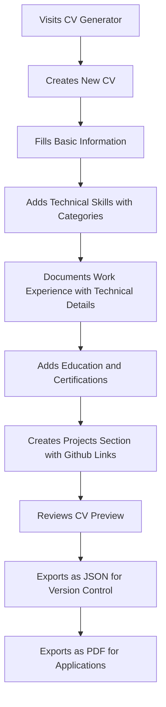
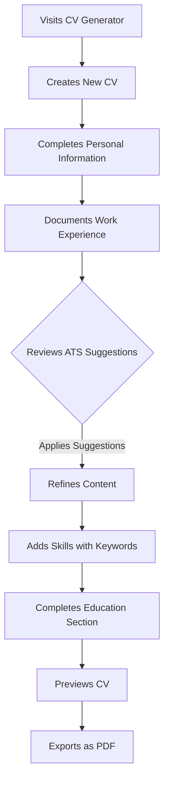
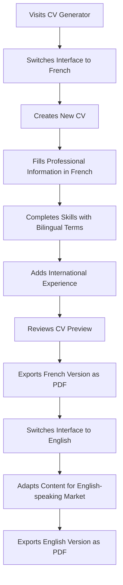
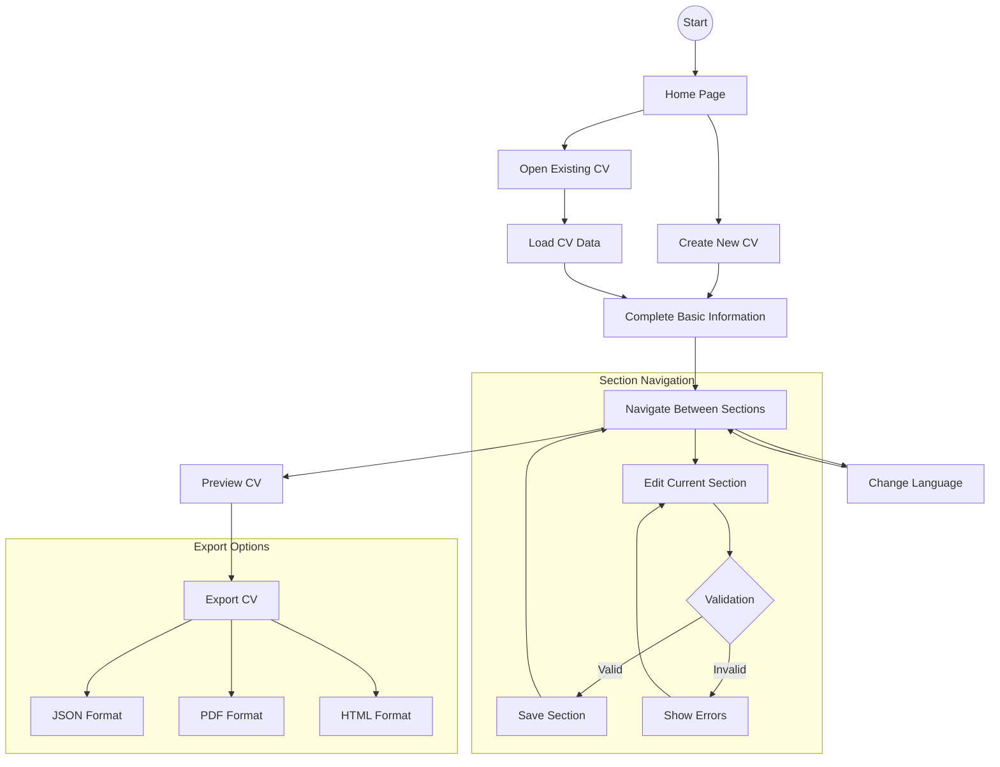
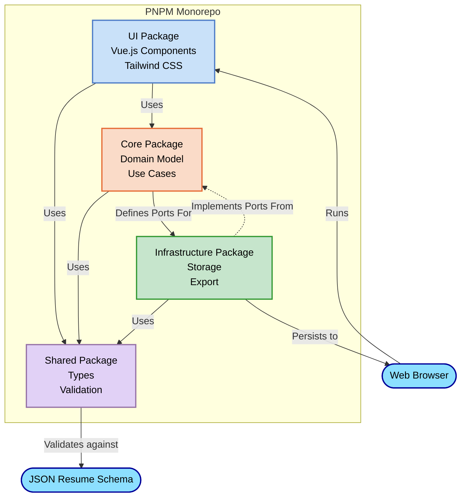
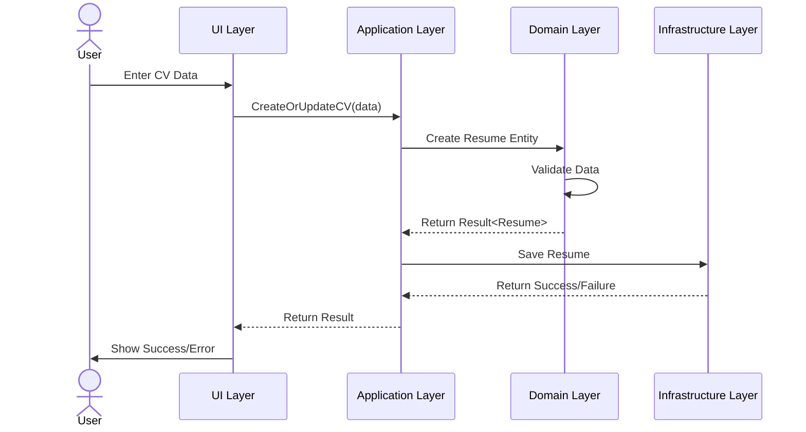
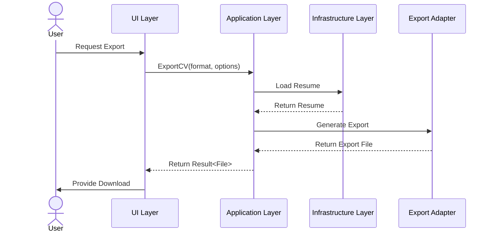
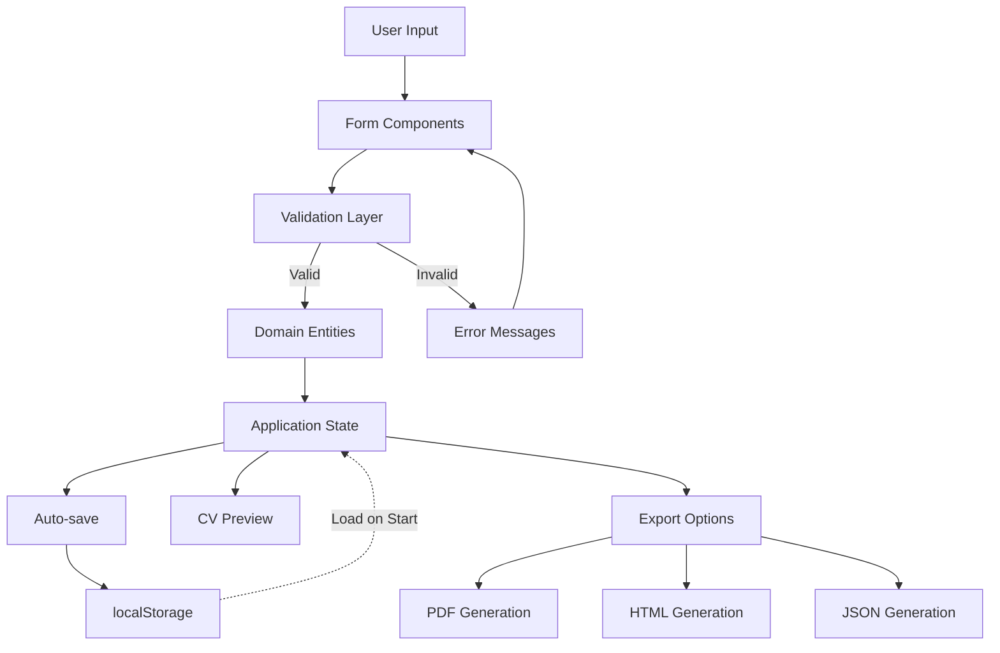
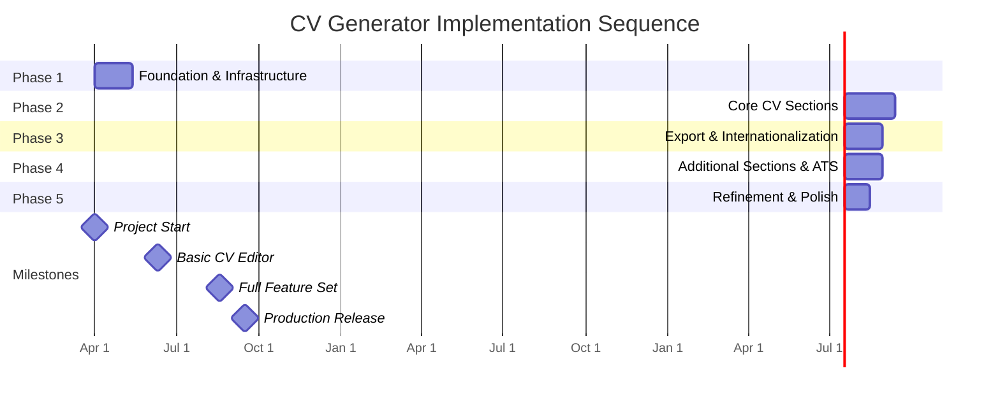

# Product Requirements Document: CV Generator

## Table of Contents

1. [Introduction](#1-introduction)
   1.1 [Project Overview](#11-project-overview)
   1.2 [Context & Business Value](#12-context--business-value)
   1.3 [Target Audience](#13-target-audience)
   1.4 [Document Purpose](#14-document-purpose)
2. [Problem Statement](#2-problem-statement)
   2.1 [Current Challenges](#21-current-challenges)
   2.2 [Opportunities](#22-opportunities)
3. [Objectives](#3-objectives)
   3.1 [Primary Objectives](#31-primary-objectives)
   3.2 [Success Criteria](#32-success-criteria)
   3.3 [Key Performance Indicators](#33-key-performance-indicators)
4. [User Journeys](#4-user-journeys)
   4.1 [Persona: Technical Professional](#41-persona-technical-professional)
   4.2 [Persona: Job Seeker](#42-persona-job-seeker)
   4.3 [Persona: Multilingual User](#43-persona-multilingual-user)
   4.4 [Key User Flows](#44-key-user-flows)
5. [Requirements](#5-requirements)
   5.1 [Functional Requirements](#51-functional-requirements)
   5.2 [Non-Functional Requirements](#52-non-functional-requirements)
   5.3 [UX/UI Requirements](#53-uxui-requirements)
   5.4 [Out of Scope](#54-out-of-scope)
6. [Technical Specifications](#6-technical-specifications)
   6.1 [System Architecture](#61-system-architecture)
   6.2 [Technical Stack](#62-technical-stack)
   6.3 [Data Management](#63-data-management)
   6.4 [Integration Points](#64-integration-points)
7. [Implementation Plan](#7-implementation-plan)
   7.1 [Development Phases](#71-development-phases)
   7.2 [Dependencies](#72-dependencies)
   7.3 [Resources & Timeline](#73-resources--timeline)
8. [Risk Assessment](#8-risk-assessment)
   8.1 [Technical Risks](#81-technical-risks)
   8.2 [User Experience Risks](#82-user-experience-risks)
   8.3 [Mitigation Strategies](#83-mitigation-strategies)
9. [Appendices](#9-appendices)
   9.1 [Glossary](#91-glossary)
   9.2 [References](#92-references)
   9.3 [JSON Resume Schema Reference](#93-json-resume-schema-reference)

## 1. Introduction

### 1.1 Project Overview

CV Generator is a modern web application designed to help users create, edit, and export professional CVs using the open-source JSON Resume standard format. It provides an intuitive interface for managing CV data with multilingual support, real-time validation, and export capabilities in multiple formats.

Key features include:

- Interactive form-based editing of all JSON Resume schema sections
- Offline-first architecture with localStorage persistence
- Export in multiple formats (JSON, HTML, PDF)
- Real-time validation and ATS optimization guidance
- Multilingual support (English and French)
- Clean, responsive interface accessible on various device sizes

The application is built as a client-side Single Page Application (SPA) using Vue.js, follows Clean Architecture principles, and is organized as a PNPM monorepo with clearly separated packages.

### 1.2 Context & Business Value

The JSON Resume format offers a structured, standardized approach to storing CV data, but lacks user-friendly tools for non-technical users. CV Generator addresses this gap by providing:

- **Data Standardization**: Leveraging the JSON Resume standard for structured, portable CV data
- **User Empowerment**: Giving users complete control over their CV data with no backend dependencies
- **Enhanced Accessibility**: Making the JSON Resume format accessible to non-technical users
- **Modern Developer Experience**: Implementing cutting-edge architecture patterns and tools

The project aligns with the following strategic objectives:

1. Promoting open standards for data portability
2. Prioritizing user data ownership through offline-first design
3. Implementing modern architecture patterns for maintainability
4. Breaking language barriers through internationalization
5. Ensuring accessibility for diverse user needs

### 1.3 Target Audience

The CV Generator targets the following primary user groups:

**Persona 1: Alex - Technical Professional (28 years old)**

- Software developer who wants to maintain a CV in a structured format
- Values technical control and data portability
- Prefers working with open formats
- Needs to export PDF for job applications
- Comfort with technical tools but wants streamlined experience

**Persona 2: Sophie - Active Job Seeker (35 years old)**

- Regularly applies to positions through various platforms
- Needs guidance to optimize CV for ATS systems
- Values simplicity and comprehensive features
- Focuses on creating effective content rather than technical details
- Prioritizes export quality for professional applications

**Persona 3: Lucie - International Consultant (31 years old)**

- Works on international projects requiring CVs in different languages
- Appreciates multilingual interface options
- Needs to adapt CV to different cultural expectations
- Values international adaptability and flexibility
- Wants consistent formatting across languages

**Persona 4: Marc - Freelancer with Multiple Profiles (42 years old)**

- Maintains multiple CV versions for different types of work
- Needs to easily modify and adapt content for specific opportunities
- Prefers offline tools for document management
- Values flexibility and customization options
- Wants efficient ways to maintain multiple related versions

### 1.4 Document Purpose

This Product Requirements Document (PRD) serves as a detailed specification of the CV Generator application, extending the vision outlined in the Project Foundation Document (PFD). It provides:

1. A comprehensive breakdown of functional and non-functional requirements
2. Detailed user journeys and experience specifications
3. Technical guidelines for implementation
4. Prioritization of features and capabilities
5. Implementation planning and risk assessment

The PRD bridges the gap between high-level business vision and detailed technical implementation, serving as the authoritative reference for developers, designers, and testers. It will guide sprint planning, task definition, and acceptance criteria throughout the development process.

## 2. Problem Statement

### 2.1 Current Challenges

Despite the prevalence of digital tools for CV creation, several challenges persist in the current landscape:

1. **Format Fragmentation**: Most CV builders use proprietary formats, creating vendor lock-in and limiting data portability.

2. **Privacy and Data Ownership Concerns**: Many online CV builders require account creation and store user data on their servers, raising privacy concerns and creating dependency on third-party services.

3. **Internet Dependency**: Most modern CV builders require a constant internet connection, limiting accessibility in offline environments.

4. **Limited Technical Standards Adoption**: The JSON Resume standard provides a structured data format for CVs, but has limited tooling for non-technical users who could benefit from its standardization.

5. **Internationalization Gaps**: Many CV tools lack robust multilingual support, creating barriers for international users or those targeting global job markets.

6. **ATS Compatibility Issues**: Many user-created CVs fail to pass through Applicant Tracking Systems (ATS) effectively, reducing applicants' chances of securing interviews.

7. **Export Limitations**: CV tools often limit export capabilities to premium tiers or provide limited format options.

### 2.2 Opportunities

These challenges present several opportunities for the CV Generator project:

1. **Open Standard Adoption**: Promote and expand adoption of the JSON Resume standard by providing accessible tooling.

2. **User Data Control**: Empower users with complete control over their CV data through an offline-first approach.

3. **Cross-Platform Accessibility**: Develop a web-based tool that works across devices and browsers without requiring installation.

4. **Enhanced User Experience**: Create an intuitive, step-by-step interface that guides users through the CV creation process with real-time feedback.

5. **Multilingual Reach**: Support multiple languages in both the interface and content, expanding accessibility to international users.

6. **ATS Optimization**: Provide guidance and validation to ensure CVs created with the tool are ATS-friendly.

7. **Modern Architecture Showcase**: Demonstrate the benefits of Clean Architecture, TypeScript, and modern frontend practices in a real-world application.

## 3. Objectives

### 3.1 Primary Objectives

The CV Generator project aims to achieve the following primary objectives:

1. **Create a User-Friendly JSON Resume Editor**

   - Develop an intuitive interface for editing all sections of the JSON Resume schema
   - Provide clear guidance and real-time validation
   - Support form-based editing with appropriate input controls for different data types

2. **Implement Comprehensive Data Management**

   - Store CV data securely in the browser's localStorage
   - Support import from and export to standard JSON Resume format
   - Implement auto-save functionality to prevent data loss
   - Enable management of multiple CV versions

3. **Deliver Multiple Export Formats**

   - Export to standard JSON Resume format
   - Generate professionally styled PDF documents
   - Create clean, semantic HTML versions
   - Ensure all exports maintain data integrity and formatting quality

4. **Provide Multilingual Support**

   - Implement a fully translated interface in English and French
   - Design for extensibility to additional languages
   - Support language switching without data loss
   - Include language-specific validation and guidance

5. **Ensure Offline Functionality**

   - Develop as a Progressive Web Application with offline capabilities
   - Implement reliable localStorage persistence
   - Handle all operations client-side without server dependencies
   - Provide clear feedback on storage status and limitations

6. **Optimize for ATS Compatibility**

   - Provide guidance on ATS-friendly content
   - Validate CV structure against ATS best practices
   - Suggest improvements for keyword optimization
   - Ensure exports are ATS-compatible

7. **Implement Clean, Maintainable Architecture**
   - Organize code following Clean Architecture principles
   - Implement strong typing with TypeScript
   - Structure as a PNPM monorepo with clear package boundaries
   - Apply domain-driven design to the CV domain

### 3.2 Success Criteria

The following criteria will determine the success of the CV Generator project:

| Criterion            | Target                                              | Measurement Method                      |
| -------------------- | --------------------------------------------------- | --------------------------------------- |
| Feature Completeness | 100% of JSON Resume schema sections implemented     | Feature inventory audit                 |
| Multilingual Support | At least 2 languages (EN, FR) with 100% coverage    | Translation completeness validation     |
| Export Quality       | Consistent appearance across export formats         | Visual comparison and user testing      |
| Performance          | Load time < 2s, interactions < 0.5s                 | Lighthouse metrics, performance testing |
| Usability            | Task completion rate > 90% for first-time users     | User testing sessions                   |
| ATS Compatibility    | 95% of generated CVs pass ATS screening simulations | ATS simulator testing                   |
| Accessibility        | WCAG 2.1 AA compliance                              | Automated accessibility testing         |
| Code Quality         | Test coverage > 80% for critical paths              | Test coverage reports                   |
| Offline Reliability  | 100% functionality without internet connection      | Offline testing scenarios               |

### 3.3 Key Performance Indicators

The following KPIs will be tracked to measure ongoing performance:

| KPI Category        | Metric                           | Target        | Tracking Method               |
| ------------------- | -------------------------------- | ------------- | ----------------------------- |
| **Performance**     | Page load time                   | < 2.0s        | Lighthouse metrics            |
|                     | Time to interactive              | < 3.5s        | Web Vitals                    |
|                     | Input response time              | < 100ms       | Custom performance tracking   |
|                     | Export generation time           | < 3.0s        | Custom performance tracking   |
| **User Experience** | Form completion rate             | > 90%         | Form analytics                |
|                     | User satisfaction                | > 4.5/5       | Feedback surveys              |
|                     | Error occurrences                | < 1%          | Error tracking                |
|                     | Time to complete CV              | < 30 min      | Session tracking              |
| **Feature Usage**   | Export usage rate                | > 80%         | Feature analytics             |
|                     | Section completion percentage    | > 90%         | CV data analysis              |
|                     | ATS suggestions followed         | > 70%         | Suggestion tracking           |
|                     | Language switching frequency     | Baseline +20% | Language preference analytics |
| **Technical**       | Browser compatibility issues     | < 1%          | Browser coverage testing      |
|                     | localStorage utilization         | < 60%         | Storage monitoring            |
|                     | Test coverage                    | > 80%         | CI/CD pipeline metrics        |
|                     | JavaScript bundle size (gzipped) | < 300KB       | Build metrics                 |

## 4. User Journeys

This section outlines the key user journeys for the primary personas using the CV Generator application. These journeys illustrate how different users interact with the application to achieve their goals.

### 4.1 Persona: Technical Professional

**Persona**: Alex, 28-year-old Frontend Developer

**Journey: Creating a Structured JSON Resume**



**Key Touchpoints and Requirements**:

1. **Initial Exploration**:

   - Alex expects a clean, technical interface that appears trustworthy
   - Needs immediate clarity on data storage (local only) and standard compliance
   - Values information about the open-source nature of the tool

2. **Technical Skills Entry**:

   - Wants to organize skills by categories (Frontend, Backend, DevOps)
   - Needs ability to indicate proficiency levels
   - Values keyword optimization for technical roles

3. **Work Experience Entry**:

   - Wants to highlight technical achievements and responsibilities
   - Needs to include specific technologies used in each role
   - Values ability to organize highlights in bullet points

4. **JSON Export**:
   - Must export 100% compliant with JSON Resume schema
   - Expects easy integration with version control systems
   - Values data portability and ownership

**Success Scenario**:
Alex successfully creates a structured CV with properly categorized skills, detailed work experiences, and project links. He exports the CV in JSON format to store in his GitHub repository and as PDF for job applications. He feels confident that his technical skills are properly represented and optimized for ATS systems.

### 4.2 Persona: Job Seeker

**Persona**: Sophie, 35-year-old Marketing Professional Seeking New Opportunities

**Journey: Creating an ATS-Optimized CV**



**Key Touchpoints and Requirements**:

1. **Initial Experience**:

   - Sophie expects an intuitive, guided interface
   - Needs clear section navigation and progress indicators
   - Values tooltips and examples for unfamiliar fields

2. **ATS Optimization**:

   - Wants real-time feedback on ATS compatibility
   - Needs suggestions for keyword optimization
   - Values guidance on formatting and structure

3. **Content Refinement**:

   - Wants help articulating achievements and responsibilities
   - Needs character/word count limits to avoid overly verbose entries
   - Values ability to reorder sections for optimal presentation

4. **Export Process**:
   - Must produce professional-looking PDFs
   - Expects formatting optimized for ATS parsing
   - Values multiple styling options for different industries

**Success Scenario**:
Sophie creates a well-structured CV with optimized content based on ATS suggestions. She refines her work experience descriptions to include relevant keywords while maintaining readability. She exports a professionally formatted PDF ready for job applications, feeling confident that her CV will effectively pass through ATS systems and reach human recruiters.

### 4.3 Persona: Multilingual User

**Persona**: Lucie, 31-year-old International Consultant

**Journey: Creating CVs for International Opportunities**



**Key Touchpoints and Requirements**:

1. **Language Selection**:

   - Lucie expects seamless language switching
   - Needs interface elements fully translated
   - Values consistency across languages

2. **Multilingual Content Entry**:

   - Wants to maintain certain terms in multiple languages
   - Needs field-specific guidance adapted to language context
   - Values culture-specific suggestions for different markets

3. **International Experience Presentation**:

   - Wants to highlight global experience effectively
   - Needs to format locations and organizations appropriately
   - Values ability to emphasize language skills and international competencies

4. **Multiple Exports**:
   - Must maintain consistent formatting across language versions
   - Expects appropriate typography for each language
   - Values ability to create region-specific CV versions

**Success Scenario**:
Lucie successfully creates both French and English versions of her CV, adapting the content appropriately for each market while maintaining consistency in her core qualifications. She appreciates the cultural context provided in the interface and exports professionally formatted PDFs tailored to both French and English-speaking opportunities.

### 4.4 Key User Flows

The following diagram illustrates the primary user flows in the CV Generator application:



**Critical User Interactions**:

1. **CV Creation/Loading**:

   - New users start fresh with guided prompts
   - Returning users can load previously saved CVs
   - Optional import from existing JSON Resume files

2. **Section Navigation**:

   - Logical progression through CV sections
   - Ability to jump between sections non-linearly
   - Clear progress indicators

3. **Content Editing**:

   - Form-based data entry with appropriate controls
   - Real-time validation with helpful error messages
   - ATS optimization suggestions

4. **Preview and Export**:

   - Real-time or on-demand preview
   - Multiple export format options
   - Style customization options

5. **Language Switching**:
   - Interface language toggle
   - Content preservation when switching languages
   - Language-specific guidance

## 5. Requirements

This section outlines the detailed requirements for the CV Generator application, organized by type and priority.

### 5.1 Functional Requirements

The following table presents the functional requirements for the CV Generator application, categorized and prioritized according to the MoSCoW method (Must have, Should have, Could have, Won't have).

#### CV Data Management

| ID     | Requirement                                                               | Priority    |
| ------ | ------------------------------------------------------------------------- | ----------- |
| FR-101 | Create a new CV based on the JSON Resume schema                           | Must Have   |
| FR-102 | Edit all sections of the JSON Resume schema through form-based interfaces | Must Have   |
| FR-103 | Auto-save CV data to localStorage as users input information              | Must Have   |
| FR-104 | Load previously saved CV data from localStorage                           | Must Have   |
| FR-105 | Import existing JSON Resume format files                                  | Should Have |
| FR-106 | Support multiple CV profiles with switching between them                  | Should Have |
| FR-107 | Provide a CV completion progress indicator                                | Should Have |
| FR-108 | Implement data compression to optimize localStorage usage                 | Should Have |
| FR-109 | Backup/restore functionality for CV data                                  | Could Have  |
| FR-110 | Version history for CV edits                                              | Could Have  |

#### Form Sections and Components

| ID     | Requirement                                              | Priority    |
| ------ | -------------------------------------------------------- | ----------- |
| FR-201 | Form for basic information (name, email, location, etc.) | Must Have   |
| FR-202 | Form for work experience with chronological sorting      | Must Have   |
| FR-203 | Form for education with chronological sorting            | Must Have   |
| FR-204 | Form for skills with level indicators                    | Must Have   |
| FR-205 | Form for projects with links and descriptions            | Must Have   |
| FR-206 | Form for volunteer work experience                       | Should Have |
| FR-207 | Form for awards and recognitions                         | Should Have |
| FR-208 | Form for publications                                    | Should Have |
| FR-209 | Form for languages with proficiency levels               | Should Have |
| FR-210 | Form for certificates with dates and issuers             | Should Have |
| FR-211 | Form for interests and activities                        | Could Have  |
| FR-212 | Form for references                                      | Could Have  |

#### Validation and Feedback

| ID     | Requirement                                                | Priority    |
| ------ | ---------------------------------------------------------- | ----------- |
| FR-301 | Real-time validation against JSON Resume schema            | Must Have   |
| FR-302 | Clear error messages for validation failures               | Must Have   |
| FR-303 | Required field indicators with visual distinctions         | Must Have   |
| FR-304 | ATS optimization suggestions for content                   | Should Have |
| FR-305 | Keyword analysis for job market relevance                  | Should Have |
| FR-306 | Character/word count for text fields with recommendations  | Should Have |
| FR-307 | Format guidance for dates, URLs, and other structured data | Should Have |
| FR-308 | Content quality suggestions (grammar, phrasing)            | Could Have  |
| FR-309 | Industry-specific content recommendations                  | Could Have  |

#### Export and Preview

| ID     | Requirement                                      | Priority    |
| ------ | ------------------------------------------------ | ----------- |
| FR-401 | Export CV as JSON in standard JSON Resume format | Must Have   |
| FR-402 | Export CV as PDF with professional formatting    | Must Have   |
| FR-403 | Real-time or on-demand CV preview                | Must Have   |
| FR-404 | Export CV as HTML                                | Should Have |
| FR-405 | Multiple PDF/HTML template options               | Should Have |
| FR-406 | Customizable styling options for exports         | Should Have |
| FR-407 | Print-optimized formatting                       | Should Have |
| FR-408 | ATS-optimized formatting for exports             | Should Have |
| FR-409 | Export with custom sections or ordering          | Could Have  |
| FR-410 | Export statistics (file size, word count, etc.)  | Could Have  |

#### Internationalization and Accessibility

| ID     | Requirement                                           | Priority    |
| ------ | ----------------------------------------------------- | ----------- |
| FR-501 | User interface available in English                   | Must Have   |
| FR-502 | User interface available in French                    | Must Have   |
| FR-503 | Language switching without data loss                  | Must Have   |
| FR-504 | Proper handling of special characters and accents     | Must Have   |
| FR-505 | Region-specific date and number formatting            | Should Have |
| FR-506 | RTL language support for interface                    | Could Have  |
| FR-507 | Additional language support beyond English and French | Could Have  |
| FR-508 | Culture-specific CV format guidance                   | Could Have  |

### 5.2 Non-Functional Requirements

This section outlines the non-functional requirements that define quality attributes of the CV Generator application.

#### Performance Requirements

| ID      | Requirement                                    | Target        | Priority    |
| ------- | ---------------------------------------------- | ------------- | ----------- |
| NFR-101 | Initial application load time                  | < 2.0 seconds | Must Have   |
| NFR-102 | Time to interactive                            | < 3.5 seconds | Must Have   |
| NFR-103 | Response time for form field interactions      | < 100ms       | Must Have   |
| NFR-104 | CV export generation time                      | < 3.0 seconds | Must Have   |
| NFR-105 | CV validation processing time                  | < 500ms       | Should Have |
| NFR-106 | Application memory usage                       | < 100MB       | Should Have |
| NFR-107 | JavaScript bundle size (gzipped)               | < 300KB       | Must Have   |
| NFR-108 | Performance degradation with large CV datasets | < 20%         | Should Have |

#### Reliability Requirements

| ID      | Requirement                  | Description                                        | Priority    |
| ------- | ---------------------------- | -------------------------------------------------- | ----------- |
| NFR-201 | Data persistence reliability | No data loss during normal operation               | Must Have   |
| NFR-202 | Error recovery mechanisms    | Graceful handling of errors with recovery options  | Must Have   |
| NFR-203 | Offline functionality        | 100% functionality without internet connection     | Must Have   |
| NFR-204 | Browser compatibility        | Consistent functionality across supported browsers | Must Have   |
| NFR-205 | Storage limit handling       | Graceful handling of localStorage limits           | Should Have |
| NFR-206 | Export reliability           | Consistent outputs across multiple export attempts | Must Have   |
| NFR-207 | State recovery               | Session recovery after browser refresh/restart     | Should Have |

#### Security and Privacy Requirements

| ID      | Requirement                     | Description                                   | Priority  |
| ------- | ------------------------------- | --------------------------------------------- | --------- |
| NFR-301 | Client-side data storage        | All CV data stored locally, never transmitted | Must Have |
| NFR-302 | No tracking or analytics        | No user tracking or data collection           | Must Have |
| NFR-303 | Clear data storage explanations | Transparent communication about data storage  | Must Have |
| NFR-304 | Export file security            | No embedded tracking in exported files        | Must Have |
| NFR-305 | Secure dependencies             | All dependencies vetted for security          | Must Have |

#### Usability Requirements

| ID      | Requirement                | Description                                      | Priority    |
| ------- | -------------------------- | ------------------------------------------------ | ----------- |
| NFR-401 | Responsive design          | Functional on mobile, tablet, and desktop        | Must Have   |
| NFR-402 | Accessibility compliance   | WCAG 2.1 AA compliance                           | Must Have   |
| NFR-403 | Intuitive navigation       | Clear pathway through CV creation process        | Must Have   |
| NFR-404 | Consistent design language | Unified visual design and interaction patterns   | Must Have   |
| NFR-405 | Error prevention           | Proactive guidance to prevent user errors        | Should Have |
| NFR-406 | Progressive disclosure     | Complex features revealed as needed              | Should Have |
| NFR-407 | Interface learnability     | First-time users can complete tasks without help | Must Have   |
| NFR-408 | Keyboard accessibility     | Full functionality via keyboard navigation       | Must Have   |

#### Maintainability Requirements

| ID      | Requirement                 | Description                                    | Priority    |
| ------- | --------------------------- | ---------------------------------------------- | ----------- |
| NFR-501 | Clean Architecture          | Separation of concerns with clear dependencies | Must Have   |
| NFR-502 | Comprehensive test coverage | > 80% code coverage for critical paths         | Must Have   |
| NFR-503 | Code documentation          | JSDoc comments for public interfaces           | Must Have   |
| NFR-504 | Type safety                 | Strong typing with TypeScript                  | Must Have   |
| NFR-505 | Component reusability       | Modular components with clear interfaces       | Should Have |
| NFR-506 | Dependency management       | Clear organization of external dependencies    | Must Have   |
| NFR-507 | Extensibility               | Architecture supports adding new features      | Must Have   |

### 5.3 UX/UI Requirements

This section outlines the user experience and interface requirements for the CV Generator application.

#### Visual Design Requirements

| ID     | Requirement                       | Description                                | Priority    |
| ------ | --------------------------------- | ------------------------------------------ | ----------- |
| UX-101 | Clean, professional visual design | Modern, trustworthy appearance             | Must Have   |
| UX-102 | Consistent color scheme           | Limited palette with clear meaning         | Must Have   |
| UX-103 | Typography hierarchy              | Clear distinction between content types    | Must Have   |
| UX-104 | Responsive layouts                | Adapts to different screen sizes           | Must Have   |
| UX-105 | Dark/light mode support           | User preference for display mode           | Could Have  |
| UX-106 | Visual feedback for interactions  | Clear indication of system state           | Must Have   |
| UX-107 | Branded identity                  | Consistent branding throughout application | Should Have |

#### Interaction Design Requirements

| ID     | Requirement                                | Description                                       | Priority    |
| ------ | ------------------------------------------ | ------------------------------------------------- | ----------- |
| UX-201 | Form field guidance                        | Clear instructions and examples for fields        | Must Have   |
| UX-202 | Progressive disclosure of complex features | Advanced options revealed when needed             | Should Have |
| UX-203 | Inline validation feedback                 | Real-time feedback on user input                  | Must Have   |
| UX-204 | Drag-and-drop reordering for list items    | Intuitive reordering of repeated sections         | Should Have |
| UX-205 | Contextual help                            | Help content relevant to current task             | Should Have |
| UX-206 | Section navigation with progress tracking  | Clear indication of completion status             | Must Have   |
| UX-207 | Undo/redo functionality                    | Ability to reverse recent actions                 | Could Have  |
| UX-208 | Interactive CV preview                     | Real-time preview with focusing relevant sections | Should Have |

#### Content Requirements

| ID     | Requirement                           | Description                                       | Priority    |
| ------ | ------------------------------------- | ------------------------------------------------- | ----------- |
| UX-301 | Microcopy for guidance                | Helpful, concise instructional text               | Must Have   |
| UX-302 | Example content                       | Samples to demonstrate effective entries          | Should Have |
| UX-303 | Tooltips for complex fields           | Additional explanation for unfamiliar concepts    | Must Have   |
| UX-304 | ATS optimization suggestions          | Guidance for improving ATS compatibility          | Should Have |
| UX-305 | Language-specific content examples    | Examples adapted to current interface language    | Should Have |
| UX-306 | Error messages with recovery guidance | Clear explanation of issues with resolution steps | Must Have   |
| UX-307 | Success confirmations                 | Positive feedback for completed actions           | Must Have   |

### 5.4 Out of Scope

The following features and capabilities are explicitly out of scope for the CV Generator project:

1. **Backend Server Implementation**:

   - No server-side processing or storage
   - No user accounts or authentication
   - No cloud-based persistence

2. **Advanced Content Features**:

   - No AI-based CV generation or content suggestions
   - No integration with job listing platforms
   - No real-time collaboration or sharing features

3. **Extended Platform Support**:

   - No native mobile applications (though responsive web design is in scope)
   - No desktop applications (though PWA installation is supported)
   - No plugins for third-party platforms

4. **Commercial Features**:

   - No payment processing or premium features
   - No subscription model
   - No white-labeling for businesses

5. **Advanced Analytics**:
   - No personal data collection
   - No usage tracking beyond basic anonymous metrics
   - No personalized recommendations based on usage patterns

## 6. Technical Specifications

This section outlines the technical design and implementation specifications for the CV Generator application.

### 6.1 System Architecture

The CV Generator follows Clean Architecture principles, with clear separation of concerns and dependencies pointing inward. The system is organized as a monorepo with four primary packages.

#### Architecture Overview



#### Package Responsibilities

1. **UI Package** (@cv-generator/ui)

   - Contains all Vue.js components, views, and composition utilities
   - Implements the user interface and user interactions
   - Manages state through Pinia stores
   - Implements routing with Vue Router
   - Handles internationalization with Vue I18n
   - Depends on Core for business logic and Shared for types and utilities

2. **Core Package** (@cv-generator/core)

   - Contains domain entities and business logic
   - Implements use cases representing application functionality
   - Defines ports (interfaces) for external dependencies
   - Implements the Result/Option pattern for error handling
   - Depends only on Shared package for types and utilities

3. **Infrastructure Package** (@cv-generator/infrastructure)

   - Implements concrete adapters for external dependencies
   - Provides localStorage persistence implementation
   - Implements PDF, HTML, and JSON export functionality
   - Depends on Core (through ports) and Shared packages

4. **Shared Package** (@cv-generator/shared)
   - Contains shared types, interfaces, and utilities
   - Implements JSON Resume schema validation with Zod
   - Provides helper functions and constants
   - Has no dependencies on other packages

#### Clean Architecture Implementation

The application follows Clean Architecture with these key characteristics:

1. **Layer Separation**:

   - Domain logic is independent of UI and infrastructure concerns
   - Dependencies point inward (UI → Core → Domain)
   - Clear interfaces between layers

2. **Port and Adapters Pattern**:

   - Core package defines ports (interfaces) for external dependencies
   - Infrastructure package implements concrete adapters
   - Allows for easy substitution of implementations

3. **Domain-Driven Design**:

   - Rich domain model with encapsulated business rules
   - Value objects for concepts like Email, DateRange, etc.
   - Ubiquitous language aligned with CV domain terminology

4. **Independent Testability**:
   - Each layer can be tested in isolation
   - Mock implementations for ports facilitate testing
   - No dependence on UI or external services for core logic testing

#### Key Architectural Flows

**CV Creation Flow**:



**CV Export Flow**:



### 6.2 Technical Stack

The CV Generator application uses the following technical stack:

#### Frontend Technologies

| Technology   | Version | Purpose                                 | Justification                                                |
| ------------ | ------- | --------------------------------------- | ------------------------------------------------------------ |
| Vue.js       | 3.4+    | UI framework and component architecture | Reactivity, composition API, TypeScript integration          |
| TypeScript   | 5.7+    | Type-safe programming language          | Type safety, better developer experience                     |
| Tailwind CSS | 4.0+    | Utility-first CSS framework             | Rapid UI development, responsiveness, consistency            |
| Vue Router   | 4.2+    | Client-side routing                     | Navigation between views, lazy loading, history management   |
| Pinia        | 2.3+    | State management                        | Modular stores, TypeScript support, Vue devtools integration |
| Vue I18n     | 9.2+    | Internationalization                    | Multiple language support, dynamic language switching        |
| Vite         | 6.0+    | Build tool and development server       | Fast HMR, efficient bundling, plugin ecosystem               |

#### Core Libraries

| Library         | Version | Purpose                          | Justification                                          |
| --------------- | ------- | -------------------------------- | ------------------------------------------------------ |
| Zod             | 3.22+   | Schema validation                | Runtime type checking, TypeScript integration          |
| jsPDF           | 2.5+    | PDF generation                   | Client-side PDF generation without server dependencies |
| uuid            | 11.0+   | Unique identifier generation     | Reliable ID generation for list items                  |
| marked          | 5.0+    | Markdown parsing                 | Support for rich text formatting in descriptions       |
| date-fns        | 2.30+   | Date manipulation and formatting | Locale-aware date operations, immutable API            |
| html-to-pdfmake | 2.4+    | HTML to PDF conversion           | Convert HTML preview to PDF format                     |

#### Development Tools

| Tool           | Version | Purpose                                | Justification                                        |
| -------------- | ------- | -------------------------------------- | ---------------------------------------------------- |
| PNPM           | 10.0+   | Package manager with workspace support | Fast, disk-efficient package management for monorepo |
| Vitest         | 3.0+    | Testing framework                      | Vue integration, fast execution, watch mode          |
| Vue Test Utils | 2.4+    | Vue component testing utilities        | Component testing helpers, shallow mounting          |
| Biome          | 1.9+    | Linting and formatting                 | Fast, modern linter and formatter                    |
| Husky          | 9.0+    | Git hooks                              | Pre-commit validation, consistent quality            |
| GitHub Actions | N/A     | CI/CD pipelines                        | Automated testing, building, deployment              |

### 6.3 Data Management

#### Data Model

The core data structure follows the JSON Resume schema, with extensions for application-specific needs.

**Primary Entities**:

1. **Resume**: The core domain entity representing a complete CV

   - Contains all sections defined in the JSON Resume schema
   - Includes metadata for application-specific features

2. **Basics**: Personal information section

   - Contains name, email, location, profiles, etc.
   - Implements validation for required fields

3. **Work Experience**: Professional history entries

   - Includes company, position, duration, achievements
   - Supports chronological ordering and date validation

4. **Education**: Educational background

   - Contains institutions, degrees, courses, durations
   - Implements date range and required field validation

5. **Skills**: Professional capabilities

   - Includes skill name, proficiency level, keywords
   - Supports categorization and priority ordering

6. **Projects**: Personal or professional projects
   - Contains project details, links, technologies
   - Supports date ranges and highlights

**Value Objects**:

The application uses value objects to encapsulate domain concepts:

1. **Email**: Validates and formats email addresses
2. **DateRange**: Manages start and end dates with validation
3. **URL**: Validates and normalizes URLs
4. **PhoneNumber**: Formats and validates phone numbers
5. **MarkdownText**: Handles text with markdown formatting

#### Persistence Strategy

The application uses a client-side only persistence strategy:

1. **Primary Storage**: Browser's localStorage API

   - CV data serialized to JSON and stored in localStorage
   - Automatic saving on changes with debouncing
   - Version tracking for schema migrations

2. **Storage Optimization**:

   - Data compression for large CVs
   - Chunking for CVs approaching localStorage limits
   - Storage usage monitoring with warnings

3. **Import/Export**:
   - Import from standard JSON Resume files
   - Export to JSON, HTML, and PDF formats
   - Backup/restore functionality for data portability

#### Data Flow



### 6.4 Integration Points

While the CV Generator is designed as a standalone client-side application, it integrates with several external standards and technologies:

#### JSON Resume Standard

The application fully supports the JSON Resume schema:

1. **Schema Compliance**:

   - All data structures align with the official schema
   - Validation ensures compliance with the standard
   - Export generates standard-compliant JSON files

2. **Ecosystem Compatibility**:
   - Generated files compatible with JSON Resume tools
   - Import support for files from other tools
   - Forward compatibility approach for schema updates

#### Browser APIs

The application utilizes several browser APIs:

1. **Storage**:

   - localStorage for persistent data storage
   - Optional IndexedDB for larger storage needs
   - File System Access API for direct file savings (where supported)

2. **Export Handling**:

   - Blob and File APIs for managing export files
   - createObjectURL for file downloads
   - Print API for PDF generation support

3. **PWA Capabilities**:
   - Service Workers for offline functionality
   - Web App Manifest for installability
   - Cache API for asset caching

#### Third-Party Integration Possibilities

While not implementing direct integrations, the application supports interoperability through:

1. **Standard Format Exports**:

   - PDF files compatible with document systems
   - HTML for web publishing
   - JSON for developer tools and platforms

2. **Data Portability**:
   - Export/import functionality for moving data between systems
   - Standard-compliant formats ensuring compatibility
   - No proprietary lock-in mechanisms

## 7. Implementation Plan

This section outlines the phased approach to implementing the CV Generator application, including timeline, dependencies, and resource allocation.

### 7.1 Development Phases

The implementation is organized into logical phases to deliver incremental value:

#### Phase 1: Foundation & Core Infrastructure

**Duration**: 6 weeks
**Focus**: Establishing the technical foundation and infrastructure

**Key Deliverables**:

- Project setup with monorepo structure
- Core package with domain model and basic entities
- Infrastructure package with localStorage persistence
- Shared package with types and validation schema
- Basic UI components and layout structure
- Continuous integration setup

**Technical Goals**:

- Implement Clean Architecture patterns
- Establish schema validation with Zod
- Create the Result/Option pattern for error handling
- Set up test infrastructure
- Implement basic persistence with localStorage

**Completion Criteria**:

- Successfully create, validate, and persist basic CV data
- Pass core unit tests for domain entities
- Complete technical infrastructure for subsequent phases

#### Phase 2: CV Editor - Essential Sections

**Duration**: 8 weeks
**Focus**: Implementing the core CV sections and editing functionality

**Key Deliverables**:

- Complete forms for essential CV sections:
  - Basic information
  - Work experience
  - Education
  - Skills
- Navigation between sections
- Real-time validation with error messages
- Auto-save functionality
- Basic CV preview

**Technical Goals**:

- Implement form components with validation
- Create composable hooks for form management
- Build validation feedback system
- Implement auto-save with debouncing

**Completion Criteria**:

- Users can create a CV with essential sections
- Data is validated in real-time
- Changes are automatically saved
- Basic preview shows entered information

#### Phase 3: Export & Internationalization

**Duration**: 6 weeks
**Focus**: Implementing export functionality and multilingual support

**Key Deliverables**:

- Export to JSON Resume format
- Basic PDF export with styling
- HTML export functionality
- Complete English UI translation
- French UI translation
- Language switching capability

**Technical Goals**:

- Implement export adapters for different formats
- Set up Vue I18n with language resources
- Create PDF templates and rendering
- Build language switching without data loss

**Completion Criteria**:

- Users can export CV in all supported formats
- UI is fully translated in both English and French
- Users can switch languages without losing data
- Exported documents maintain proper formatting

#### Phase 4: Additional Sections & ATS Optimization

**Duration**: 6 weeks
**Focus**: Implementing remaining CV sections and ATS features

**Key Deliverables**:

- Complete forms for additional CV sections:
  - Projects
  - Volunteer work
  - Awards
  - Publications
  - Languages
  - Certifications
- ATS optimization suggestions
- Enhanced CV preview with styling options
- Import functionality for existing JSON Resume files

**Technical Goals**:

- Complete remaining form components
- Implement ATS analysis algorithm
- Create enhanced preview with multiple styles
- Build import functionality

**Completion Criteria**:

- Users can create a complete CV with all JSON Resume sections
- System provides ATS optimization suggestions
- Users can import existing JSON Resume files
- Preview shows professional styling options

#### Phase 5: Refinement & Polish

**Duration**: 4 weeks
**Focus**: Enhancing user experience and fixing issues

**Key Deliverables**:

- Usability improvements based on testing
- Performance optimizations
- Mobile responsiveness enhancements
- Accessibility compliance
- Bug fixes and polishing

**Technical Goals**:

- Implement performance optimizations
- Enhance mobile experience
- Ensure WCAG 2.1 AA compliance
- Fix identified issues

**Completion Criteria**:

- Application meets performance targets
- Fully responsive on all device sizes
- Passes accessibility testing
- All critical bugs resolved

### 7.2 Dependencies

The following dependencies and prerequisites are critical for the implementation:

#### Technical Dependencies

| Dependency                       | Impact on Implementation                  | Risk Level |
| -------------------------------- | ----------------------------------------- | ---------- |
| JSON Resume Schema Stability     | Core data model and validation            | Low        |
| Browser LocalStorage Support     | Data persistence strategy                 | Low        |
| PDF Generation in Browser        | Export functionality                      | Medium     |
| Vue.js 3 Stability               | Overall application architecture          | Low        |
| TypeScript Version Compatibility | Type system and development experience    | Low        |
| Browser Compatibility            | Application functionality across browsers | Medium     |

#### External Dependencies

| Dependency               | Description                                | Contingency Plan                               |
| ------------------------ | ------------------------------------------ | ---------------------------------------------- |
| Vue.js Ecosystem         | Core framework and related libraries       | Version locking, minimal external dependencies |
| PDF Generation Libraries | Client-side PDF creation                   | Alternative libraries, feature flagging        |
| Zod Schema Validation    | Data validation against JSON Resume schema | Custom validation as fallback                  |
| Browser APIs             | localStorage, File API, etc.               | Polyfills, graceful degradation                |

#### Implementation Sequence

The implementation sequence is designed to minimize dependencies between phases:



### 7.3 Resources & Timeline

#### Team Composition

The following team structure is recommended for implementing the CV Generator:

| Role               | Responsibilities                                 | Allocation       |
| ------------------ | ------------------------------------------------ | ---------------- |
| Technical Lead     | Architecture, technical decisions, code reviews  | 100% (Full-time) |
| Frontend Developer | Vue components, UI implementation, testing       | 100% (Full-time) |
| UX/UI Designer     | Visual design, interaction design, accessibility | 50% (Part-time)  |
| QA Engineer        | Testing, quality assurance, test automation      | 50% (Part-time)  |

#### Resource Requirements

| Resource Category       | Description                      | Specification                |
| ----------------------- | -------------------------------- | ---------------------------- |
| Development Hardware    | Computers for development team   | 16GB+ RAM, modern processors |
| Development Environment | Local development setup          | Docker containers, PNPM      |
| Version Control         | Source code management           | Git, GitHub                  |
| Continuous Integration  | Automated testing and deployment | GitHub Actions               |
| Design Tools            | UI/UX design software            | Figma                        |
| Testing Infrastructure  | Cross-browser and device testing | BrowserStack, local devices  |

#### Timeline Overview

| Phase | Duration | Start Date | End Date   | Key Deliverables                                |
| ----- | -------- | ---------- | ---------- | ----------------------------------------------- |
| 1     | 6 weeks  | 2024-04-01 | 2024-05-13 | Technical foundation, architecture, persistence |
| 2     | 8 weeks  | 2024-05-14 | 2024-07-08 | Core CV sections, forms, validation, auto-save  |
| 3     | 6 weeks  | 2024-07-09 | 2024-08-19 | Export functionality, internationalization      |
| 4     | 6 weeks  | 2024-08-20 | 2024-09-30 | Additional sections, ATS optimization           |
| 5     | 4 weeks  | 2024-10-01 | 2024-10-28 | Refinement, performance, accessibility          |

**Total Project Duration**: 30 weeks (approximately 7 months)
**Target Completion Date**: October 28, 2024

## 8. Risk Assessment

This section identifies potential risks to the CV Generator project and outlines strategies for mitigation.

### 8.1 Technical Risks

| Risk ID | Risk Description                                                                                                | Probability | Impact | Risk Level | Mitigation Strategy                                                                                                                 |
| ------- | --------------------------------------------------------------------------------------------------------------- | ----------- | ------ | ---------- | ----------------------------------------------------------------------------------------------------------------------------------- |
| TR-01   | **LocalStorage Limitations**: Browser localStorage size constraints limit CV data storage                       | Medium      | High   | High       | Implement data compression, chunking strategy, storage monitoring with warnings, consider IndexedDB for larger storage needs        |
| TR-02   | **PDF Generation Inconsistencies**: Client-side PDF generation may produce inconsistent results across browsers | High        | Medium | High       | Develop standardized templates, comprehensive cross-browser testing, fallback formatting options, HTML export alternative           |
| TR-03   | **Browser Compatibility Issues**: Features may not work consistently across all target browsers                 | Medium      | Medium | Medium     | Feature detection, polyfills for older browsers, graceful degradation, comprehensive compatibility testing                          |
| TR-04   | **Performance with Large CVs**: Application performance may degrade with very detailed CVs                      | Medium      | Medium | Medium     | Performance optimization, lazy loading components, virtualized lists for large collections, pagination where appropriate            |
| TR-05   | **JSON Resume Schema Changes**: Future schema changes could break compatibility                                 | Low         | Medium | Low        | Version tracking for schema, backward compatibility handling, schema migration utilities, clear documentation of supported versions |
| TR-06   | **Third-Party Library Vulnerabilities**: Security issues in dependencies                                        | Medium      | High   | Medium     | Regular dependency updates, security scanning in CI pipeline, minimal external dependencies, manual security reviews                |
| TR-07   | **Mobile Device Limitations**: Mobile browsers may have more restricted storage and performance                 | Medium      | Medium | Medium     | Responsive testing on real devices, storage limitation warnings, simplified UI for mobile views, feature prioritization             |
| TR-08   | **Type System Limitations**: TypeScript/Zod schema validation edge cases                                        | Low         | Medium | Low        | Comprehensive test suite, runtime validation, graceful error handling, thorough type coverage                                       |

### 8.2 User Experience Risks

| Risk ID | Risk Description                                                                                | Probability | Impact | Risk Level | Mitigation Strategy                                                                                                             |
| ------- | ----------------------------------------------------------------------------------------------- | ----------- | ------ | ---------- | ------------------------------------------------------------------------------------------------------------------------------- |
| UX-01   | **Form Complexity Overwhelms Users**: Complex CV forms intimidate or confuse users              | Medium      | High   | High       | Progressive disclosure, clear section navigation, contextual help, tooltips, examples, step-by-step guidance                    |
| UX-02   | **Accessibility Barriers**: Users with disabilities face challenges using the application       | Medium      | High   | High       | WCAG 2.1 AA compliance from the start, keyboard navigation, screen reader testing, color contrast checking, accessibility audit |
| UX-03   | **Translation Quality Issues**: Poor translations reduce usability for non-English users        | Medium      | Medium | Medium     | Professional translation review, native speaker testing, contextual translation, translation glossary, user feedback mechanism  |
| UX-04   | **Export Quality Dissatisfaction**: Users unhappy with the formatting of exported CVs           | High        | Medium | High       | Multiple template options, preview before export, continuous refinement based on feedback, professional design input            |
| UX-05   | **Data Loss Concerns**: Users worry about losing CV data with client-side storage               | Medium      | High   | Medium     | Clear explanations of storage mechanism, backup/export reminders, automatic saving with confirmation, data recovery options     |
| UX-06   | **Offline Usage Confusion**: Users don't understand offline capabilities                        | Medium      | Low    | Low        | Clear offline status indicators, educational content about offline usage, prompts to save exports while online                  |
| UX-07   | **Mobile Usability Challenges**: Small screen constraints limit usability on mobile             | Medium      | Medium | Medium     | Mobile-first responsive design, simplified mobile layouts, touch-friendly controls, extensive mobile testing                    |
| UX-08   | **ATS Advice Quality**: Suggestions for ATS optimization may not reflect current best practices | Medium      | Medium | Medium     | Regular updates to ATS algorithm, research-based guidance, clear explanation of suggestion reasoning, version dating for advice |

### 8.3 Mitigation Strategies

#### Technical Risk Mitigation

1. **Storage Optimization Strategy**

   - Implement data compression for localStorage
   - Develop chunking mechanism for large CVs
   - Add storage usage monitoring with warnings
   - Research and implement IndexedDB as alternate storage
   - Create export/backup reminders for data safety

2. **Cross-Browser Compatibility Plan**

   - Establish browser support matrix with testing priorities
   - Implement feature detection rather than browser detection
   - Use polyfills for missing browser capabilities
   - Design responsive layouts with fallback styling
   - Regular cross-browser testing in CI pipeline

3. **Performance Optimization Approach**

   - Implement code splitting and lazy loading
   - Use virtualization for large lists
   - Optimize rendering with memoization
   - Monitor and improve bundle size
   - Establish performance budgets and monitoring

4. **PDF Generation Strategy**
   - Research and test multiple PDF generation libraries
   - Create standardized templates with fallbacks
   - Implement extensive testing across browsers
   - Provide HTML export as reliable alternative
   - Gather user feedback on export quality

#### User Experience Risk Mitigation

1. **User Onboarding Strategy**

   - Develop intuitive step-by-step guidance
   - Create example content and templates
   - Implement progressive disclosure of advanced features
   - Design clear navigation with progress tracking
   - Provide contextual help and tooltips

2. **Accessibility Compliance Plan**

   - Conduct early and regular accessibility audits
   - Implement keyboard navigation throughout
   - Test with screen readers and assistive technologies
   - Ensure sufficient color contrast and text sizes
   - Include accessibility in acceptance criteria

3. **Internationalization Quality Assurance**

   - Implement translation review by native speakers
   - Create translation glossary for consistency
   - Design UI with text expansion in mind
   - Test all features in each supported language
   - Gather feedback from international users

4. **Data Safety Communication**:
   - Clearly explain client-side storage mechanism
   - Implement automatic saving with visible confirmation
   - Provide one-click export for backup purposes
   - Add storage usage indicators and warnings
   - Design graceful handling of storage limitations

## 9. Appendices

### 9.1 Glossary

| Term                   | Definition                                                                                                              |
| ---------------------- | ----------------------------------------------------------------------------------------------------------------------- |
| **ATS**                | Applicant Tracking System - Software used by employers to filter, organize, and search job applications                 |
| **Clean Architecture** | Software design approach that separates concerns with dependencies pointing inward                                      |
| **CV**                 | Curriculum Vitae - A document that presents a person's education, work experience, skills, and achievements             |
| **DDD**                | Domain-Driven Design - An approach to software development focusing on the core domain and domain logic                 |
| **Debouncing**         | Programming practice that limits the rate at which a function can fire                                                  |
| **I18n**               | Internationalization - The process of designing software for adaptation to different languages and regions              |
| **JSON Resume**        | Open source standard format for resumes (https://jsonresume.org/schema/)                                                |
| **localStorage**       | Web API that allows storing key/value pairs in a web browser with no expiration time                                    |
| **Memoization**        | Optimization technique that stores results of expensive function calls and returns cached result when same inputs occur |
| **Monorepo**           | Software development strategy where code for many projects is stored in the same repository                             |
| **Option Pattern**     | Functional programming pattern for representing optional values without null/undefined                                  |
| **PDF**                | Portable Document Format - File format that preserves document formatting                                               |
| **PNPM**               | Performance NPM - Fast, disk space efficient package manager                                                            |
| **Port and Adapter**   | Architectural pattern that defines ports (interfaces) and adapters (implementations) to separate concerns               |
| **PWA**                | Progressive Web Application - Web application that can function like a native app                                       |
| **Result Pattern**     | Functional programming pattern for handling errors without exceptions                                                   |
| **SPA**                | Single Page Application - Web app that dynamically rewrites the current page                                            |
| **TypeScript**         | Strongly typed programming language that builds on JavaScript                                                           |
| **Value Object**       | Immutable object that is defined by its attributes rather than identity                                                 |
| **WCAG**               | Web Content Accessibility Guidelines - Recommendations for making web content more accessible                           |
| **Zod**                | TypeScript-first schema validation library with static type inference                                                   |

### 9.2 References

#### Technical Standards

1. **JSON Resume Schema**  
   https://jsonresume.org/schema/  
   The open source standard format for resumes that defines the data structure used in the CV Generator.

2. **Web Content Accessibility Guidelines (WCAG) 2.1**  
   https://www.w3.org/TR/WCAG21/  
   The international standard for web accessibility that the CV Generator aims to comply with.

3. **ECMAScript 2022 Specification**  
   https://tc39.es/ecma262/  
   The JavaScript language specification that forms the foundation of the application.

4. **TypeScript Language Specification**  
   https://github.com/microsoft/TypeScript/blob/main/doc/spec-ARCHIVED.md  
   The specification for TypeScript, the language used throughout the CV Generator.

#### Libraries and Frameworks

1. **Vue.js Documentation**  
   https://vuejs.org/guide/introduction.html  
   The official documentation for Vue.js, the framework used for the CV Generator.

2. **Tailwind CSS Documentation**  
   https://tailwindcss.com/docs  
   The documentation for Tailwind CSS, the utility-first CSS framework used for styling.

3. **Zod Documentation**  
   https://zod.dev/  
   The documentation for Zod, the schema validation library used for data validation.

4. **jsPDF Documentation**  
   https://artskydj.github.io/jsPDF/docs/jsPDF.html  
   The documentation for jsPDF, the library used for PDF generation.

#### Architectural References

1. **Clean Architecture**  
   Martin, R. C. (2017). Clean Architecture: A Craftsman's Guide to Software Structure and Design.  
   The book that defines the Clean Architecture principles used in the CV Generator.

2. **Domain-Driven Design**  
   Evans, E. (2003). Domain-Driven Design: Tackling Complexity in the Heart of Software.  
   The book that defines the Domain-Driven Design concepts used in the application.

3. **Result/Option Pattern**  
   https://khalilstemmler.com/articles/enterprise-typescript-nodejs/handling-errors-result-class/  
   A practical guide to implementing functional error handling in TypeScript.

#### Related Project Documents

1. **Project Foundation Document (PFD)**  
   Path: `.ai/cv-generator-pfd.md`  
   The high-level vision document for the CV Generator project.

2. **System Architecture Document**  
   Path: `.ai/system-architecture.md`  
   Detailed technical architecture specifications for the CV Generator.

### 9.3 JSON Resume Schema Reference

The CV Generator is built around the JSON Resume schema standard. This section provides a concise reference to the schema structure that forms the foundation of the application's data model.

#### Core Schema Structure

```json
{
  "basics": {
    "name": "String",
    "label": "String",
    "image": "String (URL)",
    "email": "String (Email)",
    "phone": "String",
    "url": "String (URL)",
    "summary": "String",
    "location": {
      "address": "String",
      "postalCode": "String",
      "city": "String",
      "countryCode": "String",
      "region": "String"
    },
    "profiles": [
      {
        "network": "String",
        "username": "String",
        "url": "String (URL)"
      }
    ]
  },
  "work": [
    {
      "name": "String (Company)",
      "position": "String",
      "url": "String (URL)",
      "startDate": "String (YYYY-MM-DD)",
      "endDate": "String (YYYY-MM-DD)",
      "summary": "String",
      "highlights": ["String"]
    }
  ],
  "education": [
    {
      "institution": "String",
      "url": "String (URL)",
      "area": "String",
      "studyType": "String",
      "startDate": "String (YYYY-MM-DD)",
      "endDate": "String (YYYY-MM-DD)",
      "score": "String",
      "courses": ["String"]
    }
  ],
  "skills": [
    {
      "name": "String",
      "level": "String",
      "keywords": ["String"]
    }
  ],
  "projects": [
    {
      "name": "String",
      "description": "String",
      "highlights": ["String"],
      "keywords": ["String"],
      "startDate": "String (YYYY-MM-DD)",
      "endDate": "String (YYYY-MM-DD)",
      "url": "String (URL)",
      "roles": ["String"],
      "entity": "String",
      "type": "String"
    }
  ]
}
```

#### Additional Schema Sections

The schema also includes the following optional sections:

- **volunteer**: Volunteer work experience
- **awards**: Recognitions and awards received
- **publications**: Published works and papers
- **languages**: Language proficiency
- **interests**: Personal interests and hobbies
- **references**: Professional references
- **certificates**: Professional certifications

#### Schema Extensions

The CV Generator implements several extensions to the base schema:

1. **Internal IDs**: Added to list items for stable identification
2. **Metadata**: Application-specific information for managing multiple CVs
3. **UI State**: Information about form completion and validation status
4. **Custom Sections**: Support for user-defined sections beyond the standard

#### Schema Validation

The application implements validation rules for the schema, including:

1. **Required Fields**: Certain fields like name and email are required
2. **Format Validation**: Validation for emails, URLs, dates, and other formatted fields
3. **Relationship Rules**: Validation for date ranges and related data
4. **Content Guidelines**: Validation for content length and structure

For complete schema details, refer to the official JSON Resume schema documentation: https://jsonresume.org/schema/
