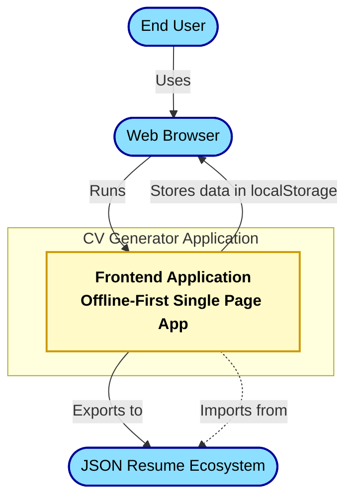
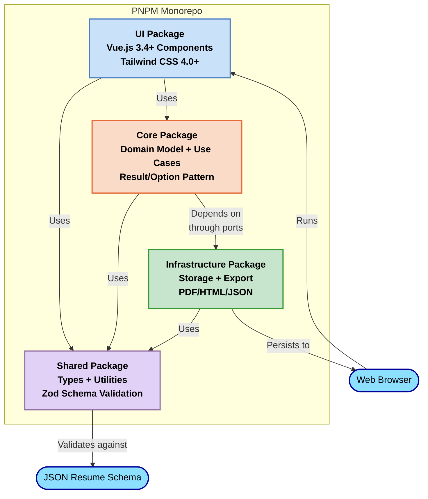
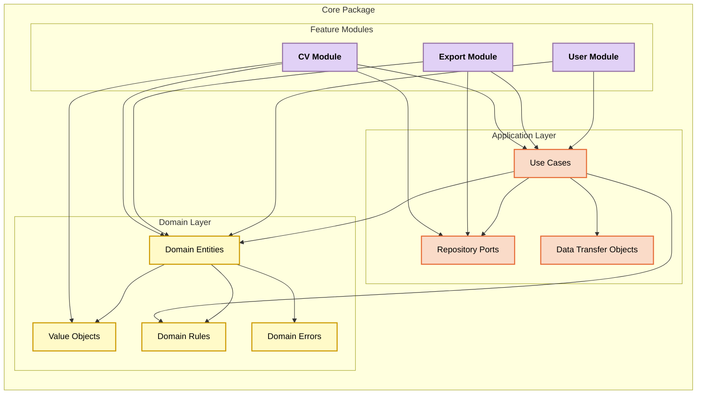
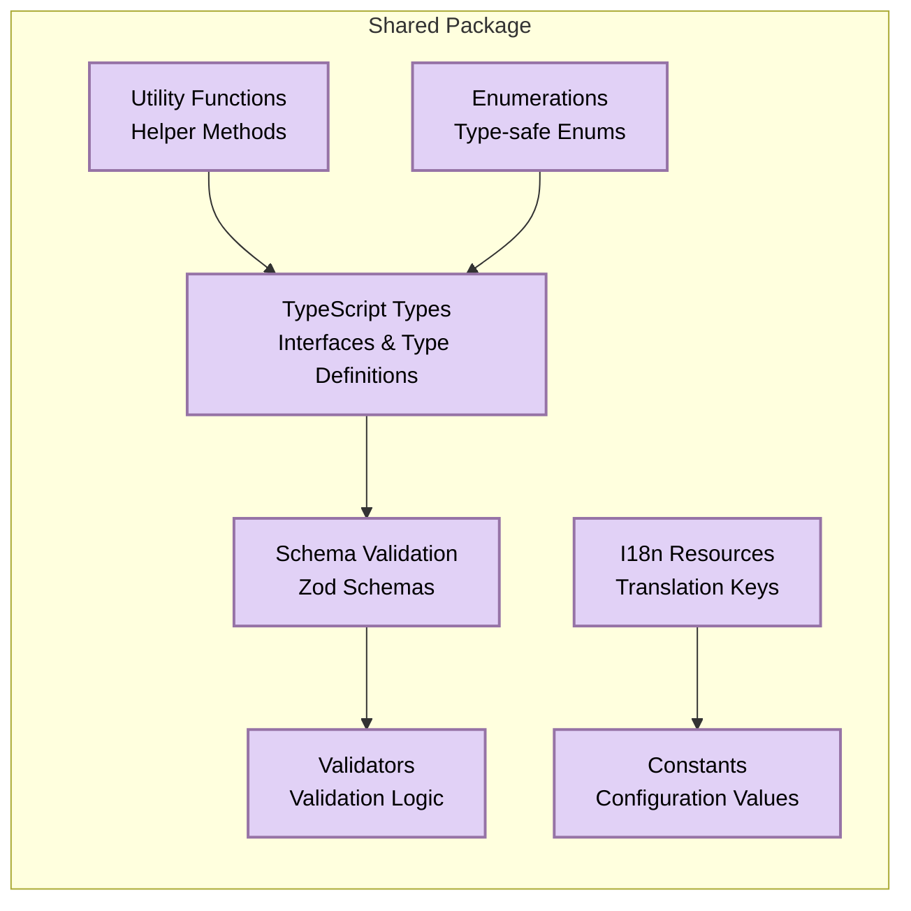
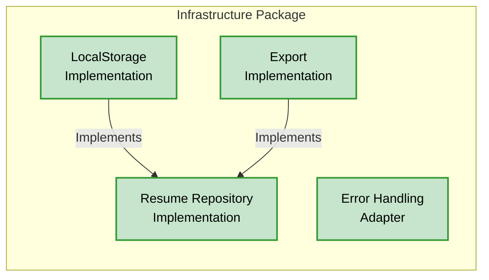
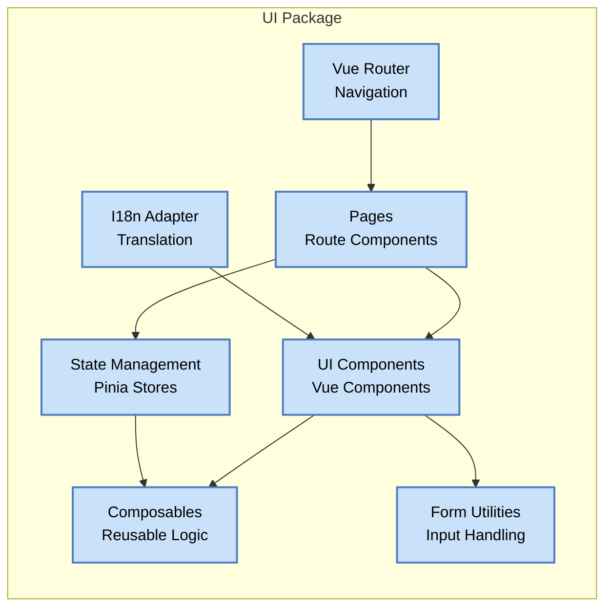
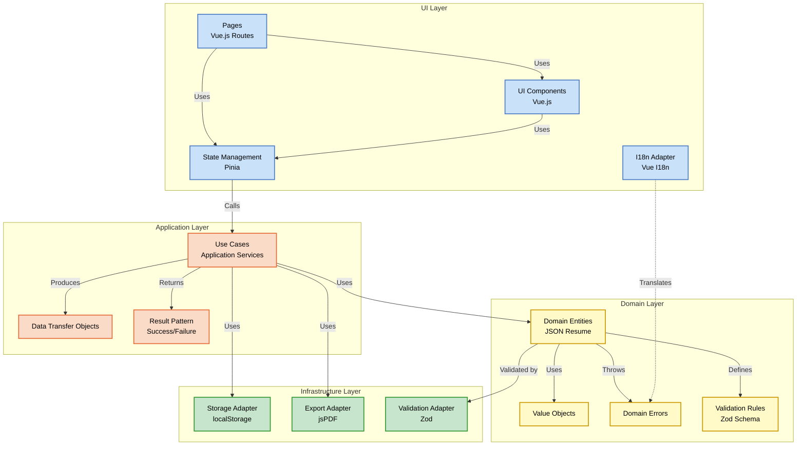
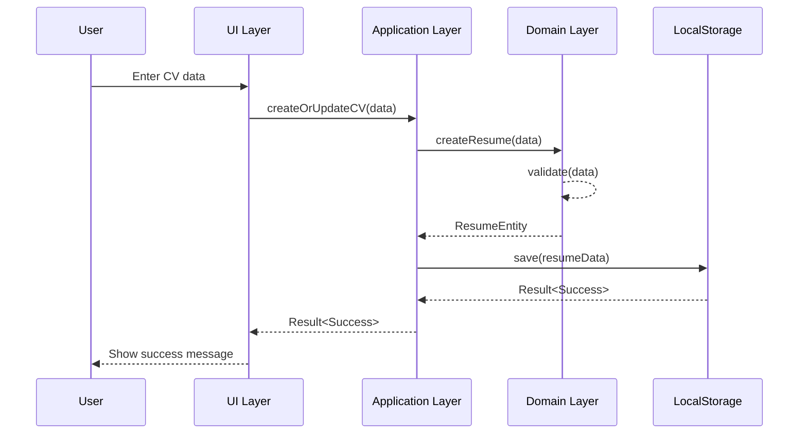
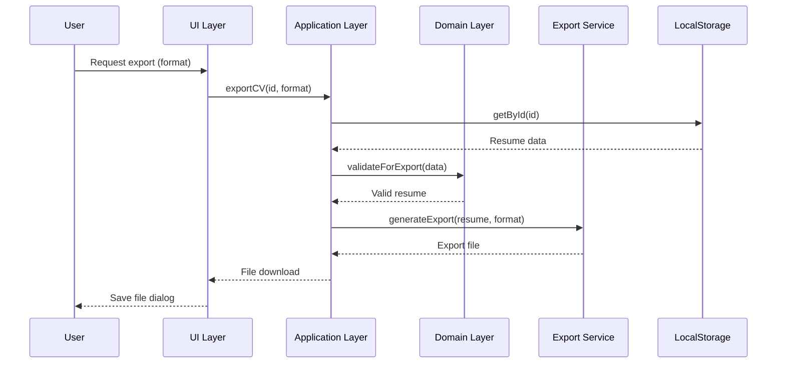
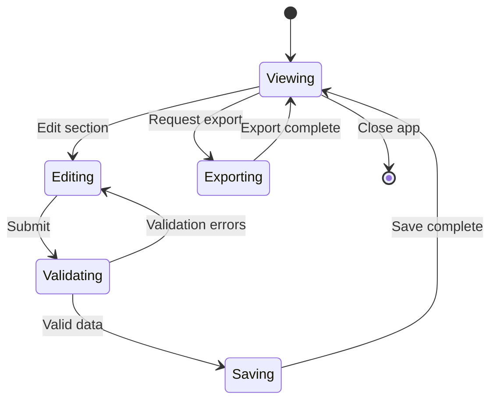

# System Architecture: CV Generator

## Table of Contents

1. [Introduction](#1-introduction)
   1.1 [Purpose](#11-purpose)
   1.2 [Scope](#12-scope)
   1.3 [Alignment](#13-alignment)
2. [Levels of Abstraction](#2-levels-of-abstraction)
   2.1 [Overview](#21-overview)
   2.2 [Navigation](#22-navigation)
3. [Level 1: Context](#3-level-1-context)
   3.1 [System Context Diagram](#31-system-context-diagram)
   3.2 [Users](#32-users)
   3.3 [External Systems](#33-external-systems)
   3.4 [Data Flows](#34-data-flows)
4. [Level 2: Container](#4-level-2-container)
   4.1 [Package Structure](#41-package-structure)
   4.2 [Monorepo Architecture](#42-monorepo-architecture)
   4.3 [Component Relationships](#43-component-relationships)
   4.4 [Technical Choices](#44-technical-choices)
5. [Level 3: Component](#5-level-3-component)
   5.1 [Core Package](#51-core-package)
   5.2 [Shared Package](#52-shared-package)
   5.3 [Infrastructure Package](#53-infrastructure-package)
   5.4 [UI Package](#54-ui-package)
   5.5 [Clean Architecture Implementation](#55-clean-architecture-implementation)
6. [Cross-Cutting Concerns](#6-cross-cutting-concerns)
   6.1 [Error Handling](#61-error-handling)
   6.2 [Logging](#62-logging)
   6.3 [Internationalization](#63-internationalization)
   6.4 [Accessibility](#64-accessibility)
   6.5 [Configuration](#65-configuration)
7. [Data Flows](#7-data-flows)
   7.1 [CV Creation Flow](#71-cv-creation-flow)
   7.2 [CV Export Flow](#72-cv-export-flow)
   7.3 [Key Interface Interactions](#73-key-interface-interactions)
8. [Technical Decisions](#8-technical-decisions)
   8.1 [Clean Architecture](#81-clean-architecture)
   8.2 [Vue.js and Frontend Technology](#82-vuejs-and-frontend-technology)
   8.3 [Storage and Persistence](#83-storage-and-persistence)
   8.4 [Validation and Schema Approach](#84-validation-and-schema-approach)
9. [Evolution](#9-evolution)
   9.1 [Technical Debt](#91-technical-debt)
   9.2 [Future Considerations](#92-future-considerations)
10. [Appendix](#10-appendix)
    10.1 [Technology Stack](#101-technology-stack)
    10.2 [Glossary](#102-glossary)
    10.3 [References](#103-references)

## 1. Introduction

### 1.1 Purpose

This System Architecture document provides a comprehensive technical blueprint for the CV Generator application. It serves as an implementation guide for developers and architects, detailing the system's structure, components, interactions, and technical decisions.

The document bridges the gap between business requirements (as defined in the PRD) and the technical implementation, ensuring alignment with the project's objectives and constraints.

### 1.2 Scope

This architecture document covers:

- The overall system structure following Clean Architecture principles
- Package organization in the PNPM monorepo
- Component-level design for all major application parts
- Interaction patterns between components
- Data flows and state management
- Technical decisions and their rationale
- Cross-cutting concerns like internationalization and error handling
- Implementation approach for offline-first operation
- Technology stack details
- Future evolution considerations

Out of scope:

- Detailed UI design and user experience (covered in the PRD)
- Business requirements (covered in the PRD)
- Deployment and DevOps considerations (covered separately)

### 1.3 Alignment

This architecture document aligns with:

- **Project Foundation Document (PFD)**: Implements the technical vision, principles, and constraints defined in the PFD
- **Product Requirements Document (PRD)**: Provides technical approaches to fulfill the functional and non-functional requirements in the PRD
- **JSON Resume Standard**: Ensures that the system architecture supports and aligns with the JSON Resume schema and ecosystem

## 2. Levels of Abstraction

### 2.1 Overview

This document follows a C4 model-inspired approach to describe the architecture at multiple levels of abstraction:

1. **Context Level**: The CV Generator system in relation to its users and external systems
2. **Container Level**: The high-level components (packages) and their relationships
3. **Component Level**: The internal structure of each package and key components

This progressive disclosure of detail allows stakeholders to understand the architecture at their level of interest and provides a clear path from high-level concepts to implementation details.

### 2.2 Navigation

- **For business stakeholders**: Focus on Sections 1-3 to understand the overall system and its context
- **For architects and technical leads**: Sections 1-6 provide the architectural approach and key decisions
- **For developers**: Sections 4-8 detail implementation aspects and component interactions
- **For maintainers and future contributors**: Sections 5-9 provide insight into internal workings and evolution path

## 3. Level 1: Context

### 3.1 System Context Diagram

The CV Generator application is a pure client-side Single Page Application (SPA) that runs within a web browser. It has no server-side components or backend dependencies, enabling full offline functionality.

### 3.2 Users

The CV Generator serves several user personas:

1. **Technical professionals** who prefer working with open formats and want data portability
2. **Job seekers** who need guidance for optimizing their CVs for ATS systems
3. **Multi-profile professionals** who maintain multiple CV versions for different purposes
4. **International consultants** who need multilingual interfaces and CV adaptability

Users interact with the system through a web browser, with the application providing a responsive interface that works across device sizes.

### 3.3 External Systems

The system has minimal dependencies on external systems:

1. **JSON Resume Ecosystem**: The application produces and consumes files compatible with the JSON Resume standard, enabling interoperability with other tools in this ecosystem.
2. **Web Browser Storage**: The application relies on the browser's localStorage mechanism for data persistence.

Unlike traditional web applications, the CV Generator does not depend on:

- Server-side processing
- Database systems
- Authentication services
- Cloud storage

This minimalist approach supports the offline-first requirement while ensuring data privacy by keeping all information on the user's device.

### 3.4 Data Flows

At the context level, the primary data flows are:

1. **User Input → Application**: The user enters CV data through the interface
2. **Application → Browser Storage**: The application persists data to browser localStorage
3. **Application → Export Formats**: The application generates PDF, HTML, and JSON outputs
4. **JSON Resume → Application**: The application can import existing JSON Resume files

These flows support the key scenarios of creating, editing, and exporting CVs while maintaining compatibility with the JSON Resume ecosystem.

## 4. Level 2: Container

### 4.1 Package Structure

The CV Generator is organized as a PNPM monorepo with four main packages:

1. **UI Package** (@cv-generator/ui)

   - Implements the user interface using Vue.js 3.4+
   - Contains pages, components, and UI state management
   - Handles form interactions and user experience
   - Dependencies: Core, Shared

2. **Core Package** (@cv-generator/core)

   - Implements domain entities and application logic
   - Organized into feature modules (cv, export, user)
   - Uses the Result/Option pattern for error handling
   - Dependencies: Shared, Infrastructure (via ports)

3. **Infrastructure Package** (@cv-generator/infrastructure)

   - Implements persistence mechanisms using localStorage
   - Handles export generation (PDF, HTML, JSON)
   - Provides concrete implementations of the core ports
   - Dependencies: Shared

4. **Shared Package** (@cv-generator/shared)
   - Provides common types, utilities, and constants
   - Implements schema validation with Zod
   - Contains shared internationalization resources
   - No dependencies on other packages

### 4.2 Monorepo Architecture

The project uses PNPM workspaces to manage the monorepo structure:

- **Workspace Configuration**: `pnpm-workspace.yaml` defines package locations
- **Package Management**: PNPM ensures efficient package installation with shared dependencies
- **Scripts**: Root-level scripts coordinate tasks across packages
- **Dependencies**:
  - Strict dependencies between packages
  - Shared dev dependencies at the root level
  - Package-specific dependencies in respective `package.json` files

This approach provides:

- Clear separation of concerns
- Ability to build and test packages independently
- Simplified dependency management
- Consistent tooling across packages

### 4.3 Component Relationships

The packages interact following Clean Architecture principles:

- **Dependency Rule**: Dependencies point inward, with UI and Infrastructure depending on Core, but Core never depending on outer layers
- **Interface Boundaries**: Core defines ports (interfaces) that Infrastructure implements
- **Shared Types**: The Shared package provides common types used across all packages
- **Dependency Injection**: Concrete implementations are injected at runtime

This structure ensures that:

- Business logic remains isolated from UI and infrastructure concerns
- Components can be replaced or modified with minimal impact on other parts
- Testing is simplified with clear boundaries for mocking

### 4.4 Technical Choices

Key technical choices at the container level:

- **TypeScript 5.7+**: For strong typing and improved developer experience
- **Vue.js 3.4+**: For reactive UI components and state management
- **Vite 6.0+**: For fast development and optimized builds
- **Zod 3.22+**: For runtime schema validation and TypeScript integration
- **Tailwind CSS 4.0+**: For utility-first styling
- **Vitest 3.0+**: For testing
- **Biome 1.9+**: For code linting and formatting

These choices align with the project's requirements for:

- Modern development experience
- Strong type safety
- Efficient offline operation
- Maintainable codebase

## 5. Level 3: Component

### 5.1 Core Package

The Core package implements the domain and application layers of the Clean Architecture:

#### Domain Layer Components:

1. **Entities**: Represent core business objects (Resume, Work, Education, etc.)

   - Encapsulate business rules and validations
   - Immutable and state-driven

2. **Value Objects**: Represent domain concepts with no identity

   - Examples: Email, DateRange, URL
   - Validation on construction
   - Immutable

3. **Domain Rules**: Business rules enforced by entities

   - Schema validation
   - Business constraints (e.g., start date before end date)

4. **Domain Errors**: Application-specific error types
   - Structured error details
   - Internationalization support

#### Application Layer Components:

1. **Use Cases**: Implement application-specific business rules

   - Orchestrate operations on entities
   - Handle application flow
   - Return Result/Option types

2. **DTOs**: Data transfer objects for crossing boundaries

   - Plain data structures
   - No business logic

3. **Ports**: Interfaces for external dependencies
   - Repository interfaces
   - Export service interfaces

#### Feature Modules:

The Core package is organized into feature modules:

1. **CV Module**: Core resume functionality

   - Resume entity and related value objects
   - CV-related use cases
   - Repository ports for CV storage

2. **Export Module**: Export functionality

   - Export use cases
   - Export service ports
   - Export-specific DTOs

3. **User Module**: User preferences and settings
   - User entity
   - Preferences management
   - User-related use cases

### 5.2 Shared Package

The Shared package provides common functionality used across other packages:

Key components:

1. **Types**: TypeScript interfaces and type definitions

   - Resume-related interfaces
   - Utility types
   - Common type patterns

2. **Schemas**: Zod validation schemas

   - JSON Resume schema
   - Custom application schemas
   - Schema validation utilities

3. **Utilities**: Helper functions and shared logic

   - Date handling
   - String manipulation
   - Type conversions

4. **Constants**: Application-wide constants

   - Feature flags
   - Configuration values
   - Default settings

5. **Validators**: Common validation logic

   - Field validators
   - Format validators
   - Error message generators

6. **I18n Resources**: Translation-related resources

   - Translation key definitions
   - I18n utility functions
   - Language detection helpers

7. **Enumerations**: Type-safe enums
   - Status values
   - Option sets
   - Named constants

### 5.3 Infrastructure Package

The Infrastructure package implements the interfaces defined in the Core package:

Key components:

1. **LocalStorageResumeRepository**:

   - Implements the ResumeRepository port from Core
   - Handles persistence to browser localStorage
   - Manages data compression and storage limits
   - Provides CRUD operations for resume data

2. **ExportImplementation**:

   - Implements the ExportService port from Core
   - Generates PDF exports using client-side libraries
   - Creates HTML exports with styling
   - Produces JSON Resume format exports

3. **Error Handling**:
   - Adapts domain errors to infrastructure context
   - Provides error logging and reporting

### 5.4 UI Package

The UI package implements the presentation layer using Vue.js:

Key components:

1. **Components**: Vue.js components organized by function

   - Form components for data entry
   - Layout components for structure
   - Utility components for reuse
   - Navigation components for user flow

2. **Pages**: Top-level route components

   - Section pages for resume sections
   - Preview pages for viewing the resume
   - Export pages for generating outputs
   - Settings pages for configuration

3. **Composables**: Reusable logic with Composition API

   - Form handling
   - Validation
   - State persistence
   - User preferences

4. **Stores**: Pinia stores for state management

   - Resume data store
   - UI state store
   - User preferences store
   - Validation store

5. **Router**: Vue Router configuration

   - Route definitions
   - Navigation guards
   - Route metadata

6. **I18n Adapter**: Internationalization implementation

   - Vue I18n integration
   - Language switching
   - Translation loading

7. **Form Utilities**: Form-specific utilities
   - Input validation
   - Form state management
   - Dynamic form generation

### 5.5 Clean Architecture Implementation

The CV Generator implements Clean Architecture principles across all packages:

The implementation enforces:

1. **Dependency Rule**: Inner layers never depend on outer layers
2. **Domain Independence**: Domain entities have no dependencies on frameworks
3. **Boundary Interfaces**: Ports and adapters for external dependencies
4. **Use Case Driven**: Application logic organized around use cases
5. **Pure Domain Model**: Business rules encapsulated in the domain model

## 6. Cross-Cutting Concerns

### 6.1 Error Handling

The application uses the Result pattern for error handling:

- **Domain Errors**: Structured error objects with error codes and messages
- **Result Type**: Generic type returning either success or failure with error details
- **Error Propagation**: Errors flow from inner to outer layers
- **UI Presentation**: Human-friendly error messages translated to the user's language

Implementation approach:

- Custom Result type in Core package
- Error hierarchies for different error types
- Centralized error handling in UI components
- Translation integration for error messages

### 6.2 Logging

Minimal logging approach focused on critical operations:

- **Error Logging**: Console logging for unexpected errors
- **Operation Logging**: Key operations logged for debugging
- **Log Levels**: Development-only verbose logging
- **Privacy**: No personal data logging

### 6.3 Internationalization

Comprehensive internationalization support:

- **Framework**: Vue I18n with browser language detection
- **Languages**: English and French fully supported
- **Translation Structure**: Nested JSON files with namespaced keys
- **Dynamic Loading**: Language files loaded on demand
- **Pluralization**: Support for pluralization rules
- **Date Formatting**: Locale-aware date formatting
- **Direction Support**: Preparation for RTL language support

Implementation details:

- Translation files in UI package
- Translation keys in Shared package
- Language detection and persistence
- User language selection
- Date and number formatting utilities

### 6.4 Accessibility

Built-in accessibility features:

- **ARIA Attributes**: Proper accessibility attributes on components
- **Keyboard Navigation**: Full keyboard support
- **Screen Reader Support**: Screen reader-friendly markup
- **Color Contrast**: WCAG 2.1 AA compliant color scheme
- **Focus Management**: Visible focus indicators
- **Form Validation**: Accessible error messages

### 6.5 Configuration

Configuration management approach:

- **Environment Variables**: Build-time environment variables
- **Feature Flags**: Runtime feature toggles
- **User Preferences**: Persistent user settings
- **Defaults**: Sensible default values
- **Configuration Constants**: Centralized configuration values

## 7. Data Flows

### 7.1 CV Creation Flow

Key steps:

1. User inputs data through form components
2. UI components collect and format data
3. Application use case invoked with input data
4. Domain entities created and validated
5. Valid entities passed to storage
6. Success/failure result returned to UI
7. User notified of the outcome

### 7.2 CV Export Flow

Key steps:

1. User requests export in specific format
2. Application retrieves CV data from storage
3. Data validated for export requirements
4. Export service generates output file
5. File offered to user for download

### 7.3 Key Interface Interactions

Key interaction patterns:

1. **Form Interaction**: Form components with real-time validation
2. **Section Navigation**: Progressive form completion with section navigation
3. **Preview Toggle**: Real-time preview of CV as data is entered
4. **Error Presentation**: Inline error messages with suggestions
5. **Export Flow**: Format selection and download process

## 8. Technical Decisions

### 8.1 Clean Architecture

**Decision**: Implement Clean Architecture with strict layer separation

**Rationale**:

- Isolates business logic from UI and infrastructure concerns
- Enables testing of business rules without UI or storage dependencies
- Supports future extensions with minimal refactoring
- Provides clear organizational structure for the codebase

**Trade-offs**:

- Increased initial development effort
- More boilerplate code
- Steeper learning curve for new developers

### 8.2 Vue.js and Frontend Technology

**Decision**: Use Vue.js 3.4+ with Composition API

**Rationale**:

- Excellent TypeScript integration
- Composition API allows for better code organization
- Strong reactivity system for complex form handling
- Smaller bundle size compared to alternatives
- Progressive framework aligned with project scaling needs

**Trade-offs**:

- Smaller ecosystem than React
- Fewer third-party components
- Learning curve for developers more familiar with other frameworks

### 8.3 Storage and Persistence

**Decision**: Use browser localStorage with compression

**Rationale**:

- Enables offline-first operation
- No backend requirement simplifies architecture
- Direct user data ownership (data stays on device)
- Simple implementation with good browser support

**Trade-offs**:

- Limited storage capacity (typically 5-10MB)
- Data tied to browser/device
- Potential data loss if browser storage is cleared

### 8.4 Validation and Schema Approach

**Decision**: Use Zod for schema validation with TypeScript integration

**Rationale**:

- Strong TypeScript integration with type inference
- Runtime validation matches compile-time types
- Detailed validation error messages
- Composable schema definitions
- Alignment with JSON Resume schema structure

**Trade-offs**:

- Additional bundle size
- Performance impact of runtime validation
- Learning curve for Zod-specific patterns

## 9. Evolution

### 9.1 Technical Debt

Current technical debt areas:

1. **Schema Versioning**: Limited support for JSON Resume schema versioning
2. **Export Templates**: Basic export templates without customization
3. **Error Handling**: Some edge cases not fully handled
4. **Storage Limitations**: No handling of localStorage limits
5. **Performance Optimization**: Large CV data can cause performance issues

Remediation plan:

- Implement schema migration utilities
- Enhance export template system
- Improve error handling with recovery options
- Add storage compression and chunking
- Optimize rendering for large datasets

### 9.2 Future Considerations

Potential future architectural enhancements:

1. **PWA Enhancement**: Service worker for improved offline capability
2. **IndexedDB**: Move from localStorage to IndexedDB for larger storage
3. **WebAssembly**: PDF generation performance improvements with WebAssembly
4. **Module Federation**: Dynamic loading of specialized CV modules
5. **Collaborative Editing**: Optional server synchronization for shared editing
6. **AI Integration**: Client-side ML models for CV improvement suggestions

Evolution strategy:

- Maintain clean architecture to facilitate extensions
- Keep extension points for future features
- Document integration patterns for contributors
- Establish versioning strategy for schema changes

## 10. Appendix

### 10.1 Technology Stack

| Category        | Technology   | Version | Purpose                |
| --------------- | ------------ | ------- | ---------------------- |
| **Frontend**    | Vue.js       | 3.4+    | UI framework           |
|                 | TypeScript   | 5.7+    | Type safety            |
|                 | Tailwind CSS | 4.0+    | Styling                |
|                 | Vue Router   | 4.2+    | Routing                |
|                 | Pinia        | 2.3+    | State management       |
|                 | Vue I18n     | 9.2+    | Internationalization   |
| **Build Tools** | Vite         | 6.0+    | Build system           |
|                 | PNPM         | 10.0+   | Package management     |
|                 | Biome        | 1.9+    | Linting and formatting |
| **Testing**     | Vitest       | 3.0+    | Testing framework      |
|                 | Playwright   | Latest  | E2E testing            |
| **Utilities**   | Zod          | 3.22+   | Schema validation      |
|                 | jsPDF        | 2.5+    | PDF generation         |
|                 | localForage  | Latest  | Storage abstraction    |

### 10.2 Glossary

| Term                   | Definition                                                                 |
| ---------------------- | -------------------------------------------------------------------------- |
| **CV**                 | Curriculum Vitae - A document summarizing a person's background            |
| **JSON Resume**        | Open standard format for resumes (https://jsonresume.org)                  |
| **Clean Architecture** | Software design pattern that separates concerns into layers                |
| **DDD**                | Domain-Driven Design - Software development approach                       |
| **SPA**                | Single Page Application - Web app loading a single HTML page               |
| **Monorepo**           | Development approach with multiple packages in a single repository         |
| **Result Pattern**     | Functional approach for handling operation results and errors              |
| **ATS**                | Applicant Tracking System - Software used by employers for recruitment     |
| **I18n**               | Internationalization - Process of adapting software to different languages |

### 10.3 References

- [JSON Resume Schema](https://jsonresume.org/schema/) - The standard for resume data structure
- [Clean Architecture](https://blog.cleancoder.com/uncle-bob/2012/08/13/the-clean-architecture.html) - Robert C. Martin's Clean Architecture principles
- [Vue.js Documentation](https://vuejs.org/) - Official Vue.js documentation
- [Zod Documentation](https://zod.dev/) - Zod schema validation library
- [PNPM Workspaces](https://pnpm.io/workspaces) - PNPM workspace documentation
- [Result/Option Pattern](https://medium.com/@dhruwlalan/option-and-result-in-typescript-cab9933e6356) - Functional error handling pattern explanation
